# 04.1-图片操作-绘制图片

## 一 canvas 提供的图像绘制 api

canvas 的绘图环境对象提供了 4 个绘制、操作图像方法：

- `drawImage()`：把图像绘制到 canvas 中，也能把 canvas 的内容或某个视频中的某一帧绘制到当前 canvas 中
- `getImageData()`：获取图像中的底层相似
- `putImageData()`：将修改的像素值放回到图像中去
- `createImageData()`：创建一个空白图像的数据对象，可以将以 CSS 像素为单位的宽度与高度值传递给该方法，作为图像数据大小，也可以传递一个已经存在的 ImageData 对象

## 二 图像绘制 drawImage()

### 2.1 图片绘制示例

drawImage() 方法可以将一幅图像的整体、部分绘制到 canvas 内的任何位置上，并且允许在绘制过程中对图像进行缩放，也可以将图像绘制在离屏 canvas 中，这样可以实现如图像查看器、淡入淡出 canvas 中。

将图像绘制到 canvas 示例：

```js
const image = new Image()
image.src = 'demo.png'

// 必须在加载完毕后的回调函数中
image.onload = function (e) {
  ctx.drawImage(image, 0, 0)
}
```

### 2.2 drawImage() 方法解析

`drawImage()`方法需要绘制的图像称为源图像（source image），绘制到的地方称为目标 canvas（destination canvas），下列参数中 s 开头为源图像，d 开头为目标 canvas：

- `drawImage(image, dx, dy)`：将整个图片绘制在 canvas 指定位置上
- `drawImage(image, dx, dy, dw, dh)`：将图像完整的 UI 之到指定的位置上（会根据目标区域的宽度与高度进行缩放）
- `drawImage(image, sx, sy, sw, sh, dx, dy, dw, dh)`：可以将一整幅图或者一部分绘制到 canvas 上，且在绘制时根据目标区域的宽度与高度对图像进行缩放。

如图所示：



贴士：image 对象是 HTMLImageElement 图片对象，也可以是 HTMLCanvasElement 类型的 canvas 对象，也可以是 HTMLVideoElement 视频对象，如果是视频对象会将视频的当前帧绘制出来

### 2.3 图像的缩放

缩放后将图像绘制于 canvas 的中心：

```js
const drawImage = () => {
  let w = canvas.width,
    h = canvas.height,
    sw = w * scale,
    sh = h * scale

  ctx.clearRect(0, 0, canvas.width, canvas.height)
  ctx.drawImage(image, -sw / 2 + w / 2, -sh / 2 + h / 2, sw, sh)
}
```
