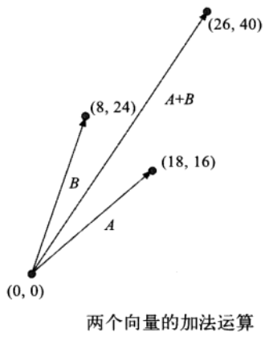

# 00-基础数学知识

## 三角函数

### 1.1 角的度量：角度与弧度

- 180 度 = π 弧度
- 1 弧度 = (π / 180) \* 度
- 1 度 = (180 / π) \* 弧度

javaScript 的 Math.sin()、 Math.cos()、 Math.tan() 函数也都采用弧度值

### 1.2 正弦、余弦、正切函数

-正弦： sin(θ) = 对边/斜边 -余弦： cos(θ) = 邻边/斜边 -正切： tan(θ) = 对边/邻边


### 1.3 向量运算

#### 1.3.1 向量的大小

任何直角三角形的斜边，等于另外两边平方和的平方根


javaScript 代码：

```js
// 从一个名为vector的向量引用中计算出该向量的大小
var vectorMagnitude = Math.sqrt(Math.pow(vector.x, 2) + Math.pow(vector.y, 2))
```

#### 1.3.2 单位向量

长度永远是 “单位 1” 的向量


javaScript 代码：

```js
// 根据一个名为vector的向量，计算出该向量的大小；然后创建一个新的unitVector对象，并将原有向量的x与y值分别除以原向量的大小，作为这个新向量的x与y值
var vectorMagnitude = Math.sqrt(Math.pow(vector.x, 2) + Math.pow(vector.y, 2))
var unitVector = new Vector()
unitVector.x = vector.x / vectorMagnitude
unitVector.y = vector.y / vectorMagnitude
```

#### 1.3.3 向量的加法与减法

如果有两个力同时作用于某个物体，可以把代表这两个力的向量相加，计算出这两个力的合力。
同样，也可以从一个方位向量之中减去另一个，以求得两点之间的边界。




**向量的加法/减法运算：**将向量的两个分量分别 相加/相减

```js
var vectorSum = new Vector()

// 加法
vectorSum.x = vectorOne.x + vectorTwo.x
vectorSum.y = vectorOne.y + vectorTwo.y

// 减法
vectorSum.x = vectorOne.x - vectorTwo.x
vectorSum.y = vectorOne.y - vectorTwo.y
```

#### 1.3.4 两个向量的点积

计算两个向量的点积，需要将两个向量的对应分量相乘，然后再将乘积相加。


点乘的几何意义和用处就是计算两个向量之间的夹角，以及在某一方向上的投影。

```js
var docProduct = vectorOne.x * vectorTwo.x + vectorOne.y * vectorTwo.y
```

注意： 点积不是向量，而是叫做 “标量” ， 它仅仅是一个数字。

- 如果两个向量的点积大于 0，意味着两个向量大概处在同一个方向上；
- 如果两个向量的点积是 0，则其必定相互垂直
