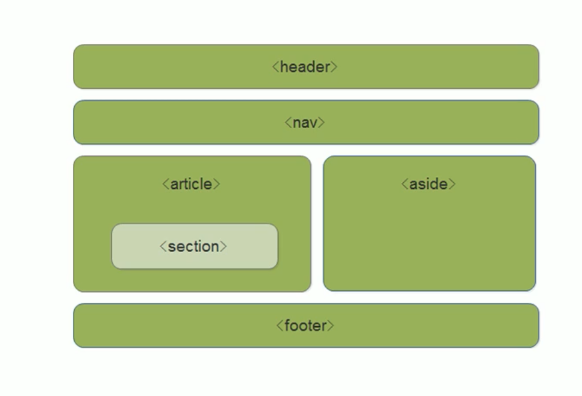

# 01.2-HTML-H5 的变化

## 一 HTML5 概念

HTML5 是一个很宽泛的概念，他不再是简单的 HTML4 标签规范的升级，而是泛指浏览器生态中的 DOM 相关的新规范。

HTML5 制定了 Web 应用的标准：更多的语义化标签，新的表单，多媒体，canvas，数据存储，地理应用等等。

HTML5 特性验证地址：<https://validator.w3.org/>

HTML5 语法变化：

```txt
HTML文档结构更加简洁清晰
标签不再区分大小写
单标签可统一写为，常见的有：area，base，br，col，hr，img，input，link，mata
省略结束标签元素：dt，dd，li，option，p，thead，tbody，tr，td，t
可省略全部标签元素：html，head，body，tbdy
允许省略属性名
允许省略属性值的引号
删除了少量的元素和属性，如 font，HTML5推荐使用CSS来控制
```

## 二 HTML5 的文档

### 2.1 HTML5 文档结构

```html
<!DOCTYPE html>
<html lang="en">
  <head>
    <meta charset="UTF-8" />
    <meta name="viewport" content="width=device-width, initial-scale=1.0" />
    <meta http-equiv="X-UA-Compatible" content="ie=edge" />
    <title>Document</title>
  </head>
  <body></body>
</html>
```

### 2.2 HTML5 中的 meta 标签

H5 可以设置多个 meta 标签：

```html
<!--过期时间-->
<meta http-equiv="Expires" content="Sat Sep 27 16:12:33 CST 2009" />
<!--禁止从缓存中读取页面-->
<meta http-equiv="Pragma " content="no-cache " />
<!--自动刷新-->
<meta http-equiv="Refresh" content="2" URL="http://www.a.com" />
<!--网页过期删Cookie-->
<meta
  http-equiv="Set-cookie"
  content="name=value expires=Sat Sep 27 16:12:33 CST 2009,path=/"
/>
```

### 2.3 H5 对标签功能的扩展

H5 对标签功能的扩展：

```html
<figure>
  <figcaption>这是图片</figcaption>
  <!--这里会换行-->
  
</figure>
```

## 三 语义化标签

### 3.0 HTML4 中的区块标签

为了表示一个网页结构中的区块相对独立，可以使用 `div` `span` 标签来表示，这 2 个标签没有任何意义。

但是大量的 div、span 标签在阅读性上有瑕疵，且对搜索引擎的优化支持有限。

为了让 div 标签实现可阅读性，往往这样做：

```html
<div class="header"></div>
<div class="nav"></div>
<div class="content"></div>
<div class="footer"></div>
```

但是这种做法对搜索引擎来说，是没有语义的，

### 3.1 标签的语义化

H5 推出了更多对引擎收录、代码阅读起到一定语义的标签来替代 div、span：

```html
<!--头部标签-->
<header></header>
<!--导航标签-->
<nav></nav>
<!--内容标签-->
<article></article>
<!--区块标签-->
<section></section>
<!--侧边栏标签-->
<aside></aside>
<!--主要区域标签-->
<main></main>
<!--底部标签-->
<footer></footer>
```

他们在页面中代表了如下区域：


标签语义化方式：

- 尽可能少的使用无语义的标签 div 和 span；
- 在语义不明显时，既可以使用 div 或者 p 时，尽量用 p, 因为 p 在默认情况下有上下间距，对兼容特殊终端有利；
- 不要使用纯样式标签，如：b、font、u 等，改用 css 设置。
- 需要强调的文本，可以包含在 strong 或者 em 标签中 strong 默认样式是加粗（不要用 b），em 是斜体（不用 i）；

### 3.2 语义化标签在 IE 中的兼容

在不支持 HTML5 新标签的浏览器里，会将这些新的标签解析成行内元素(inline)对待，所以我们只需要将其转换成块元素(block)即可使用。但是在 IE9 版本以下，并不能正常解析这些新标签，但是可以通过`document.createElement('footer')`创建的自定义标签（创建出来的元素是行内元素，因此一般情况下要给：`display:block）`。

在实际开发中，一般使用第三方兼容文件 html5shiv 来解决上述问题：

```html
<script src="html5shiv.js"></script>
<!--[if lte IE 9]>
<script type="text/javascript" src="htmlshiv.js"></script>
<![endif]--
```
