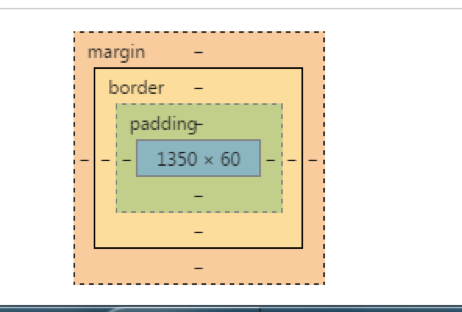

# 03.1-盒模型-盒模型使用

## 一 盒模型

### 1.1 盒模型简介

盒模型主要用来网页布局，如图所示蓝色区块为真正显示的内容，但是内容是由盒子来包裹的：



如上所示，盒子由四部分组成：

- 内容：包括文字、图片等，真正显示给用户观看的部分
- 边框 (border)：即盒子的厚度
- 内边距（padding）：内容与边框的距离
- 外边距（margin）：盒子与盒子之间的距离

贴士：元素还有一个与边框类似的属性-轮廓线（outline），该属性可以在盒子的外围画出一条不影响盒子布局、模型的线。

### 1.2 盒模型

元素的 `box-sizing` 属性可以改变计算盒子大小的方式，其值有：

- `content-box`：默认值，即宽度值表示内容宽度，而不是整个盒模型的宽度
- `border-box`：宽度将包括边框、内边距

`border-box` 可以保证盒子的大小不受到内边距的影响，适用于一些响应式场景，也称为怪异盒模型。

## 二 盒模型的三个要素

### 2.1 边框 border

常见边框属性：

```css
/* 边框宽度 */
border-width: 20px;

/* 边框样式：默认为 none(无样式），其他：solid 实线、dotted 点线、dashed 虚线 */
border-style: none;

/* 边框颜色 */
border-color: red;
```

border 书写方式：

- 只写边框的一边：`border-left: 1px solid green;`
- 只写边框的一边的一个属性：`border-top-color:green;`
- 属性联写：`border: solid 1px red;`，border 属性联写没有先后顺序限制，边框颜色、宽度可以不写。

border 的实战：

```css
.div {
  /* 只有少数边框要设计时，往往先将所有边框样式清空 */
  border: none;
  border-botto,: 1px dashed red;
}
```

### 2.2 内边距 padding

内边距设置内容距离盒子边框之间的距离：

- padding-left:左边距
- padding-right:右边距
- padding-top:上边距
- padding-bottom:下边距

属性联写：

```txt
padding: 10px;                  上，右，下，左的距离为 10px
padding: 10px 20px;             上下 10px，左右 20px
padding: 10px 20px 30px;        上 10px  左右 20px   下 30px
padding: 10px 20px 30px 40px;   上，右，下，左
```

示例：制作导航时，由于导航内容往往是不固定的，不能直接设置宽度，需要由 padding 撑开：

```css
.nav {
  height: 41px;
  border-top: 3px solid #ff8500;
  border-bottom: 3px solid #edeef0;
}

.nav a {
  display: inline-block;
  height: 41px;
  /* 不能给宽度，因为内容的大小不一，必须使用 padding 撑开 */
  padding: 0 20px;
  line-height: 41px;
}
```

**注意**：如果没有给一个盒子指定宽度，盒子的 padding 不会撑开盒子！！！如下所示：

```css
<div class='div' > <p > aaa</p > </div > .div {
  height: 100px;
  width: 100px;
  background-color: pink;
}

.div p {
  /* p 没有给定宽度，padding 生效了，但是并不会撑开盒子！ */
  padding-left: 30px;
  background-color: powderblue;
}
```

注意：作为内边距，最小值一般是 0，所以 padding 不能为负值。

### 2.3 外边距 margin

外边距设置盒子与盒子之间的距离，属性同 padding。

注意：

- 当两个盒子垂直显示的时候，外边距以最大的一个值为准
- 行内元素只有左右 margin，没有上下 margin，同理也只有左右 padding，没有上下 padding。为了照顾不同元素的兼容性，行内元素尽量只设置左右内外边距，无需设置上下内外边距（在 Chrome 中不生效，在低版本 IE 中会生效）

注意：作为外边距，margin 的值可以是负数。

## 三 标准盒模型与怪异盒模型

### 3.1 标准盒模型

在标准盒模型中，如果给盒子设置了 width、height，其实是给 content box（内容部分）设置的宽高，即元素的 width 和 height 指 **内容盒子**。所以盒子的宽高是由内容、边框、内边距一起决定的。

那么标准盒模型盒子的大小公式为：

```txt
盒子实际宽度(高度) = 内容宽度(高度) + 左右边框宽度(高度) + 左右内边距大小(高度)
```

贴士：

- **子盒子在父盒子宽度范围内，父盒子的 padding 不会影响子盒子大小**。
- 最大值、最小值可以限定盒模型的最大、最小伸缩度，其属性名为：`max-width`、`min-width`，同理 height 也有对应属性。

## 3.2 盒模型的自适应特性

如果我们要维持整个元素的大小，一旦元素盒子设置了内边距，那么就需要将内容部分作出相应的增减。即当一个块级元素设置了宽度后，就意味着其内容部分（content）的大小就是该宽度固定了，我们再额外设置 padding、margin、border 都不会影响其内容的大小，反而会将盒子变大。

```html
<!--css-->
<style>
  .box1 {
    width: 300px;
    height: 200px;
    background-color: lightcoral;
  }
  .box2 {
    width: 300px;
    height: 100px;
    background-color: yellowgreen;
    padding: 10px;
    border: 10px solid;
    margin: 10px;
  }
</style>

<!--html-->
<div class="box1">
  <div class="box2"></div>
</div>
```

我们会发现新增 padding 等属性后， box2 溢出了 box1 的范围。为了不让其溢出，可以修改 width 为：`300-20-20-20=240`。

如果不设置 box2 的宽度，则给 box2 新增 padding 等属性时则不会溢出 box1 的范围，而是其内部 content 部分缩小了，而且其内容宽度正好是上述修改后的 240。

### 3.3 怪异盒模型

怪异盒模型来自于 IE 的一些设计理念，在怪异盒模型中，所有宽度都是可见宽度，那么内容宽度其实是宽度减去边框和填充部分。

怪异盒模型可以让一些场景中的样式的设计更加简单，比如：一个输入框，我们需要给其设定 padding，就会导致输入框变大溢出，这时候可以使用怪异盒模型：

```css
input {
  width: 100%;
  padding: 10px;
  box-sizing: border-box;
}
```

## 四 标准盒模型常见问题

### 4.1 清除盒子的内外边距

对元素而言，没编剧、边框、外边距都不是必须的，但是浏览器往往有自己自带的 margin、padding。为了通用，需要将浏览器自带的 margin 清除：

```css
* {
  margin: 0;
  padding: 0;
}
```

### 4.2 外边距塌陷

对于嵌套的盒子，子盒子设置了 `margin-top` 会存在外边距塌陷的情况，如下所示：

```html
<!--css-->
<style>
  .father {
    width: 300px;
    height: 300px;
    background-color: lightcoral;
  }
  .son {
    width: 100px;
    height: 100px;
    background-color: yellowgreen;
    margin-top: 100px;
  }
</style>

<!--html-->
<div>
  <div class="father">
    <div class="son"></div>
  </div>
</div>
```

此时，虽然子盒子存在外边距，但是却没有变化，子元素的 `margin-top` 传递给父元素，反而是父盒子自己向下偏移了 100px。

解决办法：

- 1、可以使用 padding-top 来设置子元素的位置，但是需要处理子元素位置
- 2、可以给父元素添加边框，即可解决外边距塌陷问题
- 3、BFC 格式化上下文
- 4、使用现代布局：弹性布局、网格布局，不会存在该问题。

### 4.3 margin 叠加现象

同级别的盒子，垂直方向的外边距会取其最大的值：

```html
<!--css-->
<style>
  .box1 {
    width: 300px;
    height: 300px;
    background-color: lightcoral;
    margin-bottom: 30px;
  }
  .box2 {
    width: 100px;
    height: 100px;
    background-color: yellowgreen;
    margin-top: 70px;
  }
</style>

<!--html-->
<div class="box1"></div>
<div class="box2"></div>
```

示例中盒子 1 和盒子 2 的距离本应该是 100px，但是却取了其最大值：70px。

外边距叠加解决方案：

- 1、BFC 格式化上下文
- 2、使用现代布局：弹性布局、网格布局，不会存在该问题
