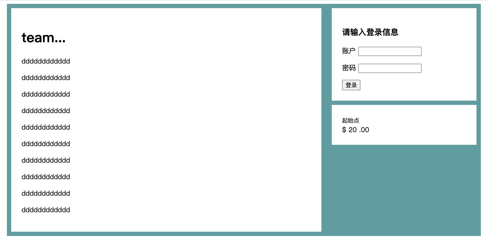

# 04.3-布局技术-弹性布局

## 一 认识 Flex 伸缩布局

### 1.1 Flex 布局概念

Flex（Flexible Box）即弹性布局（也称为伸缩布局），是一种按行、按列进行元素布局的方法，元素可以膨胀以填充额外的空间，或者收缩以适应更小的空间。整体布局方式采用弹性伸缩机制后，**子元素也不再依赖于 float、clear、vertical-align 等属性**，这些属性也会相应失效。

弹性布局为盒模型提供了最大的灵活性，任何一个容器都可以指定为 flex 布局，使用起来便利性更好，可以轻松解决困扰我们许久的垂直居中和等高列问题。

通过过给父盒子添加 flex 属性，就可以额控制子盒子的位置和排列方式：

```html
<style>
  div {
    width: 500px;
    height: 500px;
    display: flex;
    background-color: aquamarine;
  }
  div > span {
    /*父元素 flex 后，子元素无需浮动，也不区分行内元素、块元素*/
    width: 100px;
    height: 100px;
    font-size: 20px;
    background-color: burlywood;
  }
</style>

<div>
  <span>1</span>
  <span>2</span>
  <span>3</span>
</div>
```

被设置为 flex 的的盒子称呼为容器（flext container），**其直接子元素都会自动成为弹性子元素，即：相互平等的容器成员（flext item，flex 项目）**。弹性子元素高度相等（由内容决定），默认是在同一行按照从左到右的顺序并排排列。

### 1.2 Flex 布局特点

与 `inline`、`inline-block`等设置只会影响到应用了该样式的元素不同，flex 能控制内部元素的布局：

- 当我们增加子项时，会发现子项内容并不会出现换行、溢出盒子效果，会随着子项目数目变化而出现自动伸缩，这就是伸缩布局，只有当平均最小宽度无法容纳子元素时才会出现溢出情况。
- 在不给子元素设置宽度时，宽度由内容撑开
- 在不给自元素设置高度时，高度会自适应父容器

贴士：Flex 布局适合移动端，在 PC 端 IE10 以上才能得到部分支持。还可以用 display: inline-flex。它创建了一个弹性容器， 行为类似于 inline-block 元素。它会跟其他行内元素一起流式排列，但不会自动增长到 100%的宽度。内部的弹性子元素跟使用 display: flex 创建的 Flexbox 里的弹性子元素行为一样。在实际开发时，很少用到 display: inline-flex。

Flexbox 的一个重要特性在于如何基于弹性子元素的数量和其中的内容量（及大小）来计算容器的大小。但是如果网页很大，或者加载很慢时可能会产生奇怪的行为。当浏览器加载内容时，它渐进渲染到了屏幕，即使此时网页的剩余内容还在加载。假设有一个使用弹性盒子（ flex-direction: row）实现的三列布局。如果其中两列的内容加载了，浏览器可能会在加载完第三列之前就渲染这两列。然后等到剩余内容加载完，浏览器会重新计算每个弹性子元素的大小，重新渲染网页。用户会短暂地看到两列布局，然后列的大小改变（可能改变特别大），并出现第三列。

### 1.3 示例：使用 felx 布局实现导航栏

网页结构如下：

```html
<nav>
  <ul class="site-nav">
    <li><a href="#">首页</a></li>
    <li><a href="#">新闻</a></li>
    <li><a href="#">视频</a></li>
    <li class="nav-right"><a href="#">联系我们</a></li>
  </ul>
</nav>
```

基础样式：

```css
ul,
li,
a {
  list-style: none;
  text-decoration: none;
}

.site-nav {
  /* display: flex; */
  padding: 0.5em;
  border-radius: 0.2em;
}
.site-nav > li {
  margin-top: 0;
}

/*  padding加在a上不在li上是因为用户点击的是a */
.site-nav > li > a {
  display: block; /* 变为块级元素才能撑开父元素的高度 */
  padding: 0.5em 1em;
}
```

此时我们添加 flex 布局：

```css
.site-nav {
  display: flex;
  padding: 0.5em;
  border-radius: 0.2em;
}
```

对样式进行优化：

```css
/* 除了第一项之外都增加一个外边距 */
.site-nav > li + li {
  margin-left: 1.5em;
}

/* flexbox可以使用 margin: auto 来填充弹性子元素之间的可用空间，会将最后一个元素移动到右侧 */
.site-nav > .nav-right {
  margin-left: auto;
}
```

## 二 flex 属性定义子项大小

### 2.1 flex 使用示例

使用 flex 属性给两列子项分别赋以 2/3 和 1/3 的宽度：

```html
<style>
  .bg {
    padding: 1.5em;
    background-color: #fff;
  }

  .flex-box {
    display: flex;
  }
  /* 去掉顶部外边距，给每个弹性子元素之间加上间隔 */
  .flex-box > * + * {
    margin-top: 0;
    margin-left: 1.5em;
  }

  /* flex设置列宽：占满宽度的情况下分配2/3,1/3宽度 */
  .column-main {
    flex: 2;
  }
  .column-sidebar {
    flex: 1;
  }
</style>

<main class="flex-box">
  <div class="column-main bg">
    <h1>左侧文章标题</h1>
    <p>文章内容文章内容文章内容文章内容文章内容</p>
  </div>

  <div class="column-sidebar">
    <div class="bg">
      <form action="" class="login-form">
        <h3>右侧信息</h3>
        <p>
          <label for="username">账户</label>
          <input type="text" name="username" id="username" />
        </p>
        <p>
          <label for="password">密码</label>
          <input type="password" name="password" id="password" />
        </p>
        <button type="submit">登录</button>
      </form>
    </div>

    <div class="centered bg">
      <small>起始点</small>
      <div class="cost">
        <span class="cost-currency">$</span>
        <span class="cost-dollars">20</span>
        <span class="cost-cents">.00</span>
      </div>
      <a class="cta-button" href="#"></a>
    </div>
  </div>
</main>
```

贴士：推荐使用简写属性 flex， 而不是分别声明 flex-grow、 flex-shrink、flex-basis。与大部分简写属性不一样，如果在 flex 中忽略某个子属性，那么子属性的值并不会被置为初始值。相反，如果某个子属性被省略，那么 flex 简写属性会给出有用的默认值： flex-grow 为 1、 flex-shrink 为 1、 flex-basis 为 0%。这些默认值正是大多数情况下所需要的值。

### 2.2 flex 用于布局



其中第 3 个例子展示的是“圣杯”布局。众所周知，用 CSS 实现这种布局非常困难。该布局中，两个侧边栏宽度固定，而中间的列是“流动的”，即它会自动填充可用空间。重点是，三列的高度相等，该高度取决于它们的内容。尽管浮动也能实现这种布局，但需要用一些既晦涩又脆弱的技巧。你可以使用不同的弹性子元素，想出很多不同的方式来组合以上的布局。

### 2.3 flex-basis 属性

flex-basis 定义了元素大小的基准值，即一个初始的“主尺寸”。 flex-basis 属性可以设置为任意的 width 值，包括 px、 em、百分比：



flex-basis 的初始值是 auto，此时浏览器会检查元素是否设置了 width 属性值。如果有，则使用 width 的值作为 flex-basis 的值；如果没有，则用元素内容自身的大小。如果 flex-basis 的值不是 auto， width 属性会被忽略。

每个弹性子元素的初始主尺寸确定后，它们可能需要在主轴方向扩大或者缩小来适应（或者填充）弹性容器的大小。这时候就需要 flex-grow 和 flex-shrink 来决定缩放的规则。

### 2.4 flex-grow 属性

每个弹性子元素的 flex-basis 值计算出来后，它们（加上子元素之间的外边距）加起来会占据一定的宽度。加起来的宽度不一定正好填满弹性容器的宽度，多出来的留白（或剩余宽度）会按照 flex-grow（增长因子）的值分配给每个弹性子元素，flex-grow 的值为非负整数。如果一个弹性子元素的 flex-grow 值为 0，那么它的宽度不会超过 flex-basis 的值；如果某个弹性子元素的增长因子非 0，那么这些元素会增长到所有的剩余空间被分配完，也就意味着弹性子元素会填满容器的宽度。



flex-grow 的值越大，元素的“权重”越高，也就会占据更大的剩余宽度。一个 flex-grow:2 的子元素增长的宽度为 flex-grow: 1 的子元素的两倍：



2.1 示例中声明 flex: 2 和 flex: 1 设置了一个弹性基准值为 0%，因此容器宽度的 100%都是剩余宽度（减去两列之间 1.5em 的外边距）。剩余宽度会分配给两列：第一列得到 2/3 的宽度，第二列得到 1/3 的宽度。

### 2.5 使用 flex-shrink 属性

flex-shrink 属性与 flex-grow 遵循相似的原则。计算出弹性子元素的初始主尺寸后，它们的累加值可能会超出弹性容器的可用宽度。如果不用 flex-shrink，就会导致溢出：



每个子元素的 flex-shrink 值代表了它是否应该收缩以防止溢出。如果某个子元素为 flex-shrink: 0，则不会收缩；如果值大于 0，则会收缩至不再溢出。按照 flex-shrink 值的比例，值越大的元素收缩得越多。

用 flex-shrink 也能实现上述页面中两列的宽度。首先将两列的 flex-basis 指定为理想的比例（ 66.67%和 33.33%）。它们的宽度之和加上 1.5em 的间隔就会比容器宽度多出 1.5em。然后将两列的 flex-shrink 设置为 1，这样就会从每列的宽度减掉 0.75em，于是容器就能容纳两列了：

```css
.column-main {
  flex: 66.67%; /* 等价与flex:1 1  66.67% */
}
.column-sidebar {
  flex: 33.33%; /* 等价与flex:1 1  33.33% */
}
```

这种解决方案跟前面得到的结果一样，两者都能满足该页面的需求。但是有细微的差别，是因为 column-main 有内边距，而 column-sidebar 没有。当 flex-basis 为 0%时，内边距会改变弹性子元素的初始主宽度计算的方式。因此原始代码 的 column-main 比代码清单 5-8 的要宽 3em，即左右内边距的大小。如果想要精确的结果，那么要么保证两列有相同的内边距，要么用上述新的的方式设置弹性基准值。

## 三 弹性方向

### 3.1 弹性方向属性

在 flex 布局中，**元素会跟着主轴进行排列**，通过 flex-direction 来设置主轴是哪个轴（方向），设置了主轴之后，另外一个就是侧轴，元素是跟着主轴进行排列的！

- 主轴：默认是 x 轴，水平向右
- 侧轴：默认是 y 轴，水平向下

如图所示：


### 3.2 弹性方向示例

1.3 示例中右侧的两个板块已经按照上下顺序排列了，但是当左侧的内容过多高度变高后，两边就无法等高了：



想要填满高度要将右边栏（ column-sidebar）改为弹性容器，并设置 flex-direction: column。然后给里面的两个板块设置非 0 的 flex-grow 值：

```css
/* 登录央视 */
.login-form h3 {
  margin: 0;
  font-size: 0.9em;
  font-weight: bold;
  text-align: right;
  text-transform: uppercase;
}
.login-form input:not([type='checkbox']):not([type='radio']) {
  display: block;
  width: 100%;
  margin-top: 0;
}
.login-form button {
  margin-top: 1em;
  border: 1px solid #cc6b5a;
  background-color: white;
  padding: 0.5em 1em;
  cursor: pointer;
}

/* 底部 */
.column-main {
  flex: 2;
}
.column-sidebar {
  flex: 1;
  display: flex; /*让子级伸缩布局*/
  flex-direction: column;
}
.column-sidebar > .bg {
  flex: 1;
}

.centered {
  margin-top: 10px;
}
```

以上代码创建了一个嵌套的弹性盒子。对外层的弹性盒子来说， `<div class="columnsidebar">` 是弹性子元素，对内部的弹性盒子来说，它就是弹性容器。

内部的弹性盒子的弹性方向为 column，因此主轴发生了旋转，现在变成了从上到下（副轴变成了从左到右）。也就是对于弹性子元素而言， flex-basis、 flex-grow 和 flex-shrink 现在作用于元素的高度而不是宽度。由于指定了 flex: 1，因此在必要的时候子元素的高度会扩展到填满容器。无论哪边更高，主板块的底部和右边第二个小板块的底部都会对齐。

水平弹性盒子的大部分概念同样适用于垂直的弹性盒子（ column 或 column-reverse），但是有一点不同：在 CSS 中处理高度的方式与处理宽度的方式在本质上不一样。弹性容器会占据 100%的可用宽度，而高度则由自身的内容来决定。即使改变主轴方向，也不会影响这一本质。

弹性容器的高度由弹性子元素决定，它们会正好填满容器。在垂直的弹性盒子里，子元素的 flex-grow 和 flex-shrink 不会起作用，除非有“外部限制”(从外层弹性盒子计算出来的高度)强行改变弹性容器的高度。

## 四 父元素的常见属性

### 4.1 flex-direction

设置主要轴与方向：

```css
flex-direction: row;
/*
  row：默认值，设置 x 轴为主轴，即沿着 x 轴从左到右排列
  row-reverse：沿着 x 轴从右到左排列
  column：设置 y 轴为主轴，即沿着 y 轴从上往下排列
  column-reverse：着 y 轴从下往上排列
*/
```

### 4.2 flex-wrap

设置子元素是否换行：

```css
flex-wrap: nowrap;
/*
  nowrap：默认不换行，会在主轴上排成一条线。如果一行容纳不下子元素，会缩小子盒子宽度，直到最小宽度小于盒子宽度时会溢出
  wrap：换行，若父元素装不下子元素，会换行
  wrap-reverse：换行，但是换行会从反向开始

  注意：换行后，行与行之间的间距要在父容器内等分！！如果容器没有高度，换行后则所有行就贴在一起
*/
```

### 4.3 justify-content

设置主轴的子元素排列方式：

```css
justify-content: flex-start;
/*
  flex-start：默认值，在主轴上从头到尾排列，即若主轴为 x 轴则元素贴着左侧对齐
  flex-end：在主轴上从尾到头排列，即若主轴为 x 轴则元素贴着右侧对齐
  center：在主轴方向居中对齐，若主轴是 x 轴则水平居中
  space-evenly：完全平分剩余空间，各个子项之间的间距相等
  space-around：平分剩余空间，子项的左右两边间距相等
  space-between：先两边贴边，再平分剩余空间！！！
*/
```

### 4.4 flex-flow

复合属性：相当于同时设置了 flex-direction 和 flex-wrap

```css
flex-flow: row nowrap;
```

### 4.5 align-items

**单行时**，设置侧轴上的子元素排列方式：

```css
align-items: flex-start;
/*
  stretch：默认值，沿着侧轴拉伸，此时子盒子无需设置高度，因为会直接拉伸满直到达到父盒子高度 
  flex-start：从上到下
  flex-end：从下到上
  center：挤在一起居中对齐
  baseline：
*/
```

### 4.6 align-content

**允许换行时**，设置侧轴上的子元素排列方式，适用于子项出现换行的情况：

```css
align-content: stretch;
/*
  stretch：默认值，设置子项元素高度平分父元素高度
  flex-start：从侧轴的头部开始排列
  flex-end：从侧轴的尾部开始排列
  center：在侧轴的中间显示
  space-around：子项在侧轴平分剩余空间
  space-evenly：完全平分剩余空间，各个子项之间的间距相等
  space-around：平分剩余空间，子项的左右两边间距相等
  space-between：先两边贴边，再平分剩余空间！！！
*/
```

## 五 子元素常见属性

### 5.1 align-self

控制子项在侧轴上的排列方式：

```css
align-self: auto;
/*
  auto：默认值为。表示继承父元素的 align-items 属性，如果没有父元素，则等同于 stretch

  该属性允许某一单个子项与其他子项对齐方式不同，可以覆盖 align-items
*/
```

### 5.2 order

定义子项的前后顺序，数值越小越靠前：

```css
order: 0;
/*
  0：默认值
*/
```

### 4.3 flex-grow

扩展子元素宽度：

```css
flex-grow: 0;
/*
  0：默认值，不占用剩余空间
  1：占满剩余空间（子元素的宽度被扩展，视觉上达到父容器的宽度）
  可取 0-1内的值，当比值大于1时，都会占满剩余空间
  当多个兄弟子元素之间存在flex-grow属性，则进行按比例分配，比如2个子元素分为为2,1，则占据2/3，1/3
*/
```

### 5.3 flex-shrink

容器空间不足时，元素的收缩比例：

```css
flex-shrink: 1;
/*
  1：默认值。溢出部分直接被裁剪，子元素与容器大小相同
  0：不让子元素收缩，维持原有大小
  0~1：不完全收缩，溢出部分按比例收缩
  注意：收缩的比例与当前子元素的宽度有关
*/
```

### 5.4 flex-basis

指定 flex 元素在主轴方向上的长度：

```css
flex-basis: auto;
/**
  auto：默认值。
  0：最小空间，相当于没有宽度，当有内容时会有最小宽度，内容换行显示。
  可设置任意像素大小，作用是用来修改在主轴上的长度！比如主轴是x轴时，则修改其宽度，主轴是y轴时，则修改其高度
  注意：值也可以是百分比
*/
```

### 5.5 flex

flex 是定义子项目分配剩余空间的份数，是 `flex-grow`，`flex-shrink`，`flex-basis` 的缩写：

```css
flex: 0;
/*
  0：默认值，即  flex-grow:0; flex-shrink:1; flex-basis:0%;
  1：表示剩余空间被分为 1 份，即  flex-grow:1; flex-shrink:1; flex-basis:0%;
  auto：即  flex-grow:1; flex-shrink:1; flex-basis:auto;
  也支持直接属性连写：flex: 1 0 50%;
*/
```
