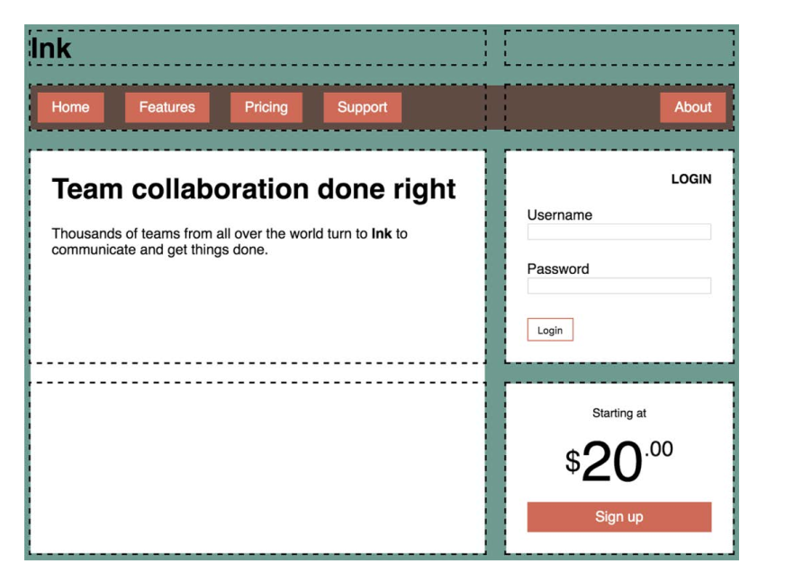

# 04.4-布局技术-网格布局

## 一 网格布局介绍

### 1.1 网格布局简介

网格布局（Grid Layout）将网页划分成一个个网格，通过组合不同的网格，制作出不同的布局效果。


网格布局与弹性布局较为相似，都是作用于两级的 DOM 结构。设置为 display: grid 的元素将成为一个网格容器（ grid container）。它的子元素则变成网格元素（ grid items）。网格布局同样也可以使用`align-items`,`justify-content`等属性。但是 Flex 布局适合在一行上进行布局，在多列自适应处理上有点捉襟见肘，不如栅格布局。

### 1.2 网格示例

制作一个 `3*3` 的网格示例如下：

```html
<style>
  .box {
    width: 300px;
    height: 300px;
    background-color: skyblue;
    display: grid;
    /* 网格容器控制大小 */
    /* 设置三列的宽度 */
    grid-template-columns: 50px 50px 50px;
    /* 设置三行的高度 */
    grid-template-rows: 100px 100px 100px;
  }
  .box div {
    /* 子项无需加大小，大小由网格控制 */
    background-color: yellowgreen;
  }
</style>

<div class="box">
  <div>1</div>
  <div>2</div>
  <div>3</div>
  <div>4</div>
  <div>5</div>
  <div>6</div>
  <div>7</div>
  <div>8</div>
  <div>9</div>
</div>
```

使用 display: grid 定义一个网格容器。容器会表现得像一个块级元素， 100%填充可用宽度。也可以使用 inline-grid，这样元素就会在行内流动，且宽度只能够包含子元素，不过 inline-grid 的使用频率不高。

网格容器中的两个属性：`grid-template-columns` 、 `grid-template-rows` 定义了网格每行每列的大小。其值也可以使用了一种新单位 fr
代表每一列（或每一行）的分数单位（ fraction unit）。这个单位跟 Flexbox 中 flex-grow 因子的表现一样，下列表示三列等宽：

```css
grid-template-columns: 1fr 1fr 1fr;
```

### 1.3 网格布局包含的几个概念

除了网格容器和网格元素外，网格布局还包括四个重要概念：

- 网格线：`grid line` 水平与垂直的网格线构成了网格的整体结构，如果指定了 grid-gap 的话，它就位于网格线上。
- 网格轨道： `grid track` 是两条相邻网格线之间的空间。网格有水平轨道（行）和垂直轨道（列）。
- 网格单元： `grid cell` 是网格上的单个空间，水平和垂直的网格轨道交叉重叠的部分。
- 网格区域： `grid area` 是网格上的矩形区域，由一个到多个网格单元组成。

构建网格布局时会涉及这些组成部分。比如声明 grid-template-columns: 1fr 1fr 1fr 就会定义三个等宽且垂直的网格轨道，同时还定义了四条垂直的网格线：一条在网格最左边，两条在每个网格轨道之间，还有一条在最右边。

### 1.4 网格拆分一个网页



拆分代码示例：

```css
/* 页面中的整个父容器 */
.container {
  display: grid;
  grid-template-columns: 2fr 1fr;
  grid-template-rows: repeat(4, auto);
  grid-gap: 1.5em;
  max-width: 1080px;
  margin: 0 auto;
}

/* 从1号垂直网格线跨越到 3 号垂直网格线 */
header,
nav {
  grid-column: 1 / 3;
  grid-row: span 1;
}

.main {
  /* 从1号垂直网格线跨越到 2 号垂直网格线 */
  grid-column: 1 / 2;
  grid-row: 3 / 5;
}

/* 从2号垂直网格线跨越到 3 号垂直网格线 */
.sidebar-top {
  grid-column: 2 / 3;
  grid-row: 3 / 4;
}

/* 从2号垂直网格线跨越到 3 号垂直网格线 */
.sidebar-bottom {
  grid-column: 2 / 3;
  grid-row: 4 / 5;
}
```

代码首先设置了网格容器，并用 grid-template-columns 和 grid-template-rows 定义了网格轨道。因为列的分数单位分别是 2fr 和 1fr，所以第一列的宽度是第二列的两倍。定义行的时候用到了一个新方法： repeat()函数。它在声明多个网格轨道的时候提供了简写方式。

grid-template-rows: repeat(4, auto);定义了四个水平网格轨道，高度为 auto，这等价于 grid-template-rows: auto auto auto auto。轨道大小设置为 auto，轨道会根据自身内容扩展。

用 repeat()符号还可以定义不同的重复模式，比如 repeat(3, 2fr 1fr)会重复三遍这个模式，从而定义六个网格轨道，重复的结果是 2fr 1fr 2fr 1fr 2fr 1fr。

grid-column 可以让网格元素占满网格的宽度，其实还可以用一个特别的关键字 span 来指定 grid-row 和 grid-column 的值（这里用在了 grid-row 上）。这个关键字告诉浏览器元素需要占据一个网格轨道。因为这里没有指出具体是哪一行，所以会根据网格元素的布局算法（ placement algorithm） 自动将其放到合适的位置。布局算法会将元素放，在网格上可以容纳该元素的第一处可用空间，如本例第一行和第二行。

## 二 网格与 flex 配合

网格与 flex 是互补的，并不冲突：

- Flexbox 本质上是一维的，而网格是二维的，所以它很适合用在相似的元素组成的行（或列）上。虽然可以 flex-wrap 换行，但是没法让上一行元素跟下一行元素对齐。
- Flexbox 是以内容为切入点由内向外工作的，而网格是以布局为切入点从外向内工作的



1.4 示例的拆分中，顶部的导航链接由于是水瓶对齐，所以可以在网格布局基础上，使用 flex：

```css
.site-nav {
  display: flex;
  margin: 0;
  padding: 0.5em;
  background-color: #5f4b44;
  list-style-type: none;
  border-radius: 0.2em;
}
.site-nav > li {
  margin-top: 0;
}
.site-nav > li > a {
  display: block;
  padding: 0.5em 1em;
  background-color: #cc6b5a;
  color: white;
  text-decoration: none;
}
.site-nav > li + li {
  margin-left: 1.5em;
}
.site-nav > .nav-right {
  margin-left: auto;
}
```

总结：

```txt
当设计要求元素在两个维度上都对齐时，使用网格；
当只关心一维的元素排列时，使用Flexbox。

在实践中，这通常意味着：
网格更适合用于整体的网页布局；
Flexbox 更适合对网格区域内的特定元素布局。
```

## 三 网格命名

### 3.1 网格线命名编号

有时候记录所有网格线的编号实在太麻烦了，尤其是在处理很多网格轨道时。为了能简单点，可以给网格线命名，并在布局时使用网格线的名称而不是编号。声明网格轨道时，可以在中括号内写上网格线的名称，如下代码片段所示。

```css
grid-template-columns: [start] 2fr [center] 1fr [end];
```

这条声明定义了两列的网格，三条垂直的网格线分别叫作 start、 center 和 end。之后定义网格元素在网格中的位置时，可以不用编号而是用这些名称来声明：

```css
grid-column: start / center;
```

这条声明将网格元素放在 1 号网格线（ start）到 2 号网格线（ center）之间的区域。还可以给同一个网格线提供多个名称，比如下面的声明（为了可读性，这里将代码换行了）：

```css
grid-template-columns:
  [left-start] 2fr
  [left-end right-start] 1fr
  [right-end];
```

示例：

```css
.container {
  display: grid;
  grid-template-columns:
    [left-start] 2fr
    [left-end right-start] 1fr
    [right-end];
  grid-template-rows: repeat(4, [row] auto);
  grid-gap: 1.5em;
  max-width: 1080px;
  margin: 0 auto;
}
header,
nav {
  grid-column: left-start / right-end;
  grid-row: span 1;
}
.main {
  grid-column: left;
  grid-row: row 3 / span 2;
}
.sidebar-top {
  grid-column: right;
  grid-row: 3 / 4;
}
.sidebar-bottom {
  grid-column: right;
  grid-row: 4 / 5;
}
```

### 3.2 网格区域命名

网格容器的 grid-template 属性和网格元素的 grid-area 属性支持下，可以不用计算或者命名网格线，直接用命名的网格区域将元素定位
到网格中。

```css
.container {
  display: grid;
  grid-template-areas:
    'title title'
    'nav nav'
    'main aside1'
    'main aside2';
  grid-template-columns: 2fr 1fr;
  grid-template-rows: repeat(4, auto);
  grid-gap: 1.5em;
  max-width: 1080px;
  margin: 0 auto;
}
header {
  grid-area: title;
}
nav {
  grid-area: nav;
}
.main {
  grid-area: main;
}
.sidebar-top {
  grid-area: aside1;
}
.sidebar-bottom {
  grid-area: aside2;
}
```

每个命名的网格区域必须组成一个矩形。不能创造更复杂的形状，比如 L 或者 U 型。还可以用句点（ .）作为名称，这样便能空出一个网格单元。比如，以下代码定义了四个网格区域，中间围绕着一个空的网格单元。

```css
grid-template-areas:
  'top top right'
  'left . right'
  'left bottom bottom';
```

## 四 显式网格与隐式网格

### 4.1 隐式网格使用场景

在某些场景下，你可能不清楚该把元素放在网格的哪个位置上。如：当处理大量的网格元素时，挨个指定元素的位置未免太不方便。当元素是从数据库获取时，元素的个数可能是未知的。在这些情况下，以一种宽松的方式定义网格可能更合理，剩下的交给布局算法来放置网格元素。

这时需要用到隐式网格（ implicit grid）。使用 `grid-template-*` 属性定义网格轨道时，创建的是显式网格（ explicit grid），但是有些网格元素仍然可以放在显式轨道外面，此时会自动创建隐式轨道以扩展网格，从而包含这些元素。

隐式网格轨道默认大小为 auto，也就是它们会扩展到能容纳网格元素内容。可以给网格容器设置 grid-auto-columns 和 grid-auto-rows，为隐式网格轨道指定一个大小。

贴士：在指定网格线的时候，隐式网格轨道不会改变负数的含义。负的网格线编号仍然是从显式网格的右下开始的。

### 4.2 照片墙示例

照片墙示例：在这个布局中，将设置列的网格轨道，但是网格行是隐式创建的。这样网页不必关心照片的数量，它能适应任意数量的网格元素。只要照片需要换行显示，就会隐式创建新的一行。（flex 和浮动很难实现）

```html
<div class="portfolio">
  <!-- 每个<figure>都是一个网格元素：将图片和标题封装在其中 -->
  <!-- featured 类让某些图片更大 -->
  <figure class="featured">
    
    <figcaption>Monkey</figcaption>
  </figure>
  <figure>
    
    <figcaption>Eagle</figcaption>
  </figure>
  <figure class="featured">
    
    <figcaption>Bird</figcaption>
  </figure>
  <figure>
    
    <figcaption>Bear</figcaption>
  </figure>
  <figure class="featured">
    
    <figcaption>Swan</figcaption>
  </figure>
  <figure>
    
    <figcaption>Elephants</figcaption>
  </figure>
  <figure>
    
    <figcaption>Owl</figcaption>
  </figure>
</div>
```

css：

```css
body {
  background-color: #709b90;
  font-family: Helvetica, Arial, sans-serif;
}
.portfolio {
  display: grid;
  /* 将最小列宽设置为 200px，自动填充网格 */
  grid-template-columns: repeat(auto-fill, minmax(200px, 1fr));
  /* 将隐式水平网格轨道的大小设置为 1fr */
  grid-auto-rows: 1fr;
  grid-gap: 1em;
}

.portfolio > figure {
  /* 覆盖浏览器默认的外边距 */
  margin: 0;
}
.portfolio img {
  max-width: 100%;
}
.portfolio figcaption {
  padding: 0.3em 0.8em;
  background-color: rgba(0, 0, 0, 0.5);
  color: #fff;
  text-align: right;
}
```

有时候我们不想给一个网格轨道设置固定尺寸，但是又希望限制它的最小值和最大值。这时候需要用到 minmax()函数。它指定两个值：最小尺寸和最大尺寸。浏览器会确保网格轨道的大小介于这两者之间。（如果最大尺寸小于最小尺寸，最大尺寸就会被忽略。）通过指定 `minmax(200px, 1fr)`，浏览器确保了所有的轨道至少宽 200px。repeat()函数里的 auto-fill 关键字是一个特殊值。设置了之后，只要网格放得下，浏览器就会尽可能多地生成轨道，并且不会跟指定大小（ minmax()值）的限制产生冲突。

auto-fill 和 minmax(200px, 1fr)加在一起，就会让网格在可用的空间内尽可能多地产生网格列，并且每个列的宽度不会小于 200px。因为所有轨道的大小上限都为 1fr（最大值），所以所有的网格轨道都等宽。

在上述示例中，视口能容纳四个 200px 宽的列，因此一行有四个网格轨道。如果屏幕变宽，就能放下更多轨道。如果屏幕变窄，产生的轨道数也会变少。如果网格元素不够填满所有网格轨道， auto-fill 就会导致一些空的网格轨道。如果不希望出现空的网格轨道，可以使用 auto-fit 关键字代替 auto-fill。它会让非空的网格轨道扩展，填满可用空间。

具体选择 auto-fill 还是 auto-fit 取决于你是想要确保网格轨道的大小，还是希望整个网格容器都被填满。一般推荐 auto-fit。

### 4.3 添加变化

如何让特定图片变大？

现在每个网格元素都占据了 1×1 的区域，将特定图片的尺寸增加到 2×2 的网格区域。可以用 featured 类选择这些元素，让它们在水平和垂直方向上都占据两个网格轨道。

由于元素按顺序排列，增加某些网格元素的大小会导致网格中出现空白区域，因为空间容不下，就会下降到下一个网格轨道。

当不指定网格上元素的位置时，元素会按照其布局算法自动放置。默认情况下，布局算法会按元素在标记中的顺序将其逐列逐行摆放。当一个元素无法在某一行容纳（也就是说该元素占据了太多网格轨道）时，算法会将它移动到下一行，寻找足够大的空间容纳它。

网格布局模块规范提供了另一个属性 grid-auto-flow，它可以控制布局算法的行为。它的初始值是 row，上一段描述的就是这个值的行为。如果值为 column，它就会将元素优先放在网格列中，只有当一列填满了，才会移动到下一行。

还可以额外加一个关键字 dense（比如， grid-auto-flow: column dense）。它让算法紧凑地填满网格里的空白，尽管这会改变某些网格元素的顺序。加上这个关键字，小元素就会“回填”大元素造成的空白区域。

```css
.portfolio {
  display: grid;
  grid-template-columns: repeat(auto-fill, minmax(200px, 1fr));
  grid-auto-rows: 1fr;
  grid-gap: 1em;
  /* 开启紧凑的网格布局算法 */
  grid-auto-flow: dense;
}
.portfolio .featured {
  grid-row: span 2;
  grid-column: span 2;
}
```

这段代码使用了 grid-auto-flow: dense，等价于 grid-auto-flow: row dense。（前面的写法里隐含了 row，因为初始值就是 row。）然后选择特定的图片，将其设置为在水平和垂直方向上各占据两个网格轨道。注意，本例只用了 span 关键字，没有明确地将任何一个网格元素放到某个网格轨道上。

在你的屏幕上看到的效果可能跟示例不完全一致，这取决于视口的大小。因为这里用 auto-fill 决定垂直的网格轨道的数量，所以大屏幕可以容纳更多的轨道，小屏幕则容纳得较少。我截图的时候视口宽度是 1000px，有四个网格轨道。调整浏览器宽度到不同的大小，看看网格自动生成多少轨道来填充可用空间。

需要注意的是，紧凑的 auto-flow 方式会导致元素出现的顺序跟 HTML 里不一致。当使用键盘（ Tab 键）或者使用以源码顺序而非以显示顺序为准的屏幕阅读器来浏览网页时，用户可能会感到困惑。

### 4.4 让网格元素填满网格轨道

较大的图片没有完全填满网格单元，在图片下面留了一片小小的空白。理想情况下，每个元素的顶部和底部都应该跟同一网格轨道上的元素对齐。

默认情况下，每个网格元素都会扩展并填满整个网格区域，但是子元素不会，因此网格区域出现了多余的高度。一个简单的解决办法是用 Flexbox。在代码清单 6-11 里，设置每个 `<figure>`为弹性容器，方向为 column，元素会从上到下垂直排列。然后给图片标签加上 flex-grow，强制拉伸图片填充空白区域。

但是拉伸图片并不可取，因为这会改变图片的宽高比，导致图片变形。好在 CSS 为控制这一行为提供了一个特殊属性 object-fit。默认情况下，一个``的 object-fit 属性值为 fill，也就是说整个图片会缩放，以填满``元素。你也可以设置其他值改变默认行为。比如， object-fit 属性的值还可以是 cover 和 contain（如图 6-17 所示）。这些值告诉浏览器，在渲染盒子里改变图片的大小，但是不要让图片变形。

- cover：扩展图片，让它填满盒子（导致图片一部分被裁剪）。
- contain：缩放图片，让它完整地填充盒子（导致盒子里出现空白）

这里有两个概念要区分清楚：盒子（由``元素的宽和高决定）和渲染的图片。默认情况下，这二者大小相等。 object-fit 属性让我们能在盒子内部控制渲染图片的大小，同时保持盒子的大小不变。

因为用 flex-grow 属性拉伸了图片，所以应该给它加上 object-fit: cover 防止渲染的图片变形。作为妥协，图片的边缘会被裁掉一部分

```css
/* 让每个网格元素都成为垂直的 Flexbox */
.portfolio > figure {
  display: flex;
  flex-direction: column;
  margin: 0;
}
.portfolio img {
  /* 用弹性拉伸，让图片填充弹性容器的可用空间 */
  flex: 1;
  /* 让渲染的图片填充盒子并且不被拉伸（而是裁掉边缘） */
  object-fit: cover;
  max-width: 100%;
}
```

## 五 网格常用属性

### 5.1 子项小于单元格时的定义元素对齐方式

子项的设定的 columns、row 小于容器时：

```css
/* 子项在自己的单元格内水平方向对齐方式 */
justify-items: center;
/* 垂直方向 */
align-items: start;

/* 这 2 个属性可以复合简写为 */
palce-items: start center;
```

示例：

```html
<!--容器宽300px，3个单元格宽均为100px-->
<style>
  .box {
    width: 300px;
    height: 300px;
    background-color: skyblue;
    display: grid;
    grid-template-columns: 100px 100px 100px;
    grid-template-rows: 100px 100px 100px;
    justify-items: center;
  }
  .box div {
    width: 50px;
    height: 50px;
    background-color: yellowgreen;
  }
</style>

<div class="box">
  <div>1</div>
  <div>2</div>
  <div>3</div>
  <div>1</div>
  <div>2</div>
  <div>3</div>
  <div>1</div>
  <div>2</div>
  <div>3</div>
</div>
```

子项的设定的 columns、row 大于容器时使用：

```css
align-content: end;
justify-content: space-evenly;

/* 这 2 个属性可以复合简写为 */
palce-content: end space-evenly;
```

示例：

```html
<style>
  .box {
    width: 500px;
    height: 500px;
    background-color: skyblue;
    display: grid;
    grid-template-columns: 100px 100px 100px;
    grid-template-rows: 100px 100px 100px;
    justify-content: center;
  }
  .box div {
    width: 50px;
    height: 50px;
    background-color: yellowgreen;
  }
</style>

<div class="box">
  <div>1</div>
  <div>2</div>
  <div>3</div>
  <div>1</div>
  <div>2</div>
  <div>3</div>
  <div>1</div>
  <div>2</div>
  <div>3</div>
</div>
```

### 5.2 设置间隙

```css
/* 行间距 */
grid-row-gap: 20px;
/* 列间隙 */
grid-column-gap: 10px;

/* 简写 */
grid-gap: 20px 10px;
```

贴士：这里推荐使用 `row-gap`、`colunm-gap`、`gap`，因为弹性布局也可以使用。
