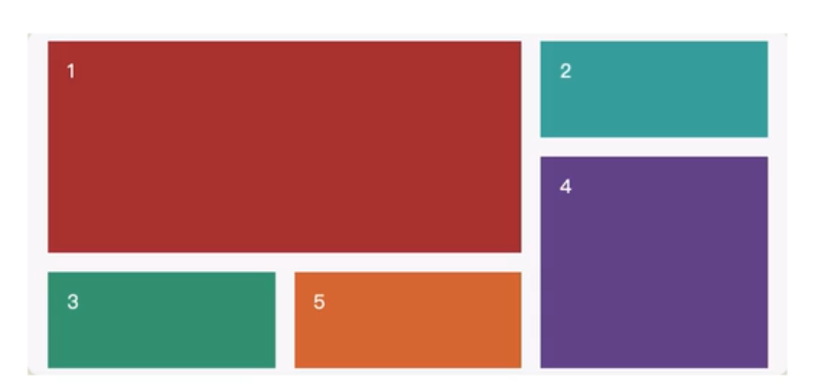

# 04.4-布局技术-网格布局

## 一 网格布局概念

网格布局（Grid Layout）将网页划分成一个个网格，通过组合不同的网格，制作出不同的布局效果。



网格布局与弹性布局较为相似，同样可以使用`align-items`,`justify-content`等属性。但是 Flex 布局适合在一行上进行布局，在多列自适应处理上有点捉襟见肘，不如栅格布局。

制作一个 `3*3` 的网格示例如下：

```html
<style>
  .box {
    width: 300px;
    height: 300px;
    background-color: skyblue;
    display: grid;
    /* 网格容器控制大小 */
    /* 设置三列的宽度 */
    grid-template-columns: 50px 50px 50px;
    /* 设置三行的高度 */
    grid-template-rows: 100px 100px 100px;
  }
  .box div {
    /* 子项无需加大小，大小由网格控制 */
    background-color: yellowgreen;
  }
</style>

<div class="box">
  <div>1</div>
  <div>2</div>
  <div>3</div>
  <div>4</div>
  <div>5</div>
  <div>6</div>
  <div>7</div>
  <div>8</div>
  <div>9</div>
</div>
```

网格布局主要使用基于网格的行列的维度去定义网格线的名称、网格轨道的大小：

- `grid-template-rows`：设置子项每列宽度
- `grid-template-columns`：设置每行的高度

## 二 网格常用属性

### 2.1 列宽度与行高度

`grid-template-rows`与`grid-template-columns`的值可以是像素值、是百分比，也可以是 `auto`，表示自适应剩余空间大小。

不过网格也有其自己专属的网格单位：`fr`，其本质是个比例值：

```css
/* 平分 */
grid-template-columns: 1fr 1fr 1fr;
grid-template-rows: 0.3fr 50%fr;
```

### 2.2 定义网格区域

可以提前对网格区域进行命名，在子项中设置子项使用哪些区域的命名：

```html
<style>
  .box {
    width: 300px;
    height: 300px;
    background-color: skyblue;
    display: grid;
    grid-template-columns: 1fr 1fr 1fr;
    grid-template-rows: 1fr 1fr 1fr;
    /* 设定一个命名 */
    grid-template-areas:
      'a1 a1 a2'
      'a1 a1 a2'
      'a3 a3 a3';
  }
  .box div {
    background-color: yellowgreen;
    border: 1px black solid;
  }

  .box :nth-child(1) {
    grid-area: a1;
  }

  .box :nth-child(2) {
    grid-area: a2;
  }
</style>

<div class="box">
  <div>1</div>
  <div>2</div>
  <div>3</div>
</div>
```

注意：未设置的子项会自动从开始未知填充，如下所示，2、3 盒子都位于上方：

```html
<style>
  .box {
    width: 300px;
    height: 300px;
    background-color: skyblue;
    display: grid;
    grid-template-columns: 1fr 1fr 1fr;
    grid-template-rows: 1fr 1fr 1fr;
    /* 设定一个命名 */
    grid-template-areas:
      'a1 a1 a2'
      'a1 a1 a2'
      'a3 a3 a3';
  }
  .box div {
    background-color: yellowgreen;
    border: 1px black solid;
  }

  .box :nth-child(1) {
    grid-area: a3;
  }
</style>

<div class="box">
  <div>1</div>
  <div>2</div>
  <div>3</div>
</div>
```

### 2.3 定义网格区域的简写方式 grid-template

```css
/* 原始方式 */
grid-template-columns: 1fr 1fr 1fr;
grid-template-rows: 1fr 1fr 1fr;
/* 设定一个命名 */
grid-template-areas:
  'a1 a1 a2'
  'a1 a1 a2'
  'a3 a3 a3';

/* 简写方式 */
grid-template:
  'a1 a1 a2' 1fr
  'a1 a1 a2' 1fr
  'a3 a3 a3' 1fr
  / 1fr 1fr 1fr;
```

简写方式中，命名块后面的是每行的大小，`/` 后面的是每列的大小。

### 2.4 子项小于单元格时的定义元素对齐方式

子项的设定的 columns、row 小于容器时：

```css
/* 子项在自己的单元格内水平方向对齐方式 */
justify-items: center;
/* 垂直方向 */
align-items: start;

/* 这 2 个属性可以复合简写为 */
palce-items: start center;
```

示例：

```html
<!--容器宽300px，3个单元格宽均为100px-->
<style>
  .box {
    width: 300px;
    height: 300px;
    background-color: skyblue;
    display: grid;
    grid-template-columns: 100px 100px 100px;
    grid-template-rows: 100px 100px 100px;
    justify-items: center;
  }
  .box div {
    width: 50px;
    height: 50px;
    background-color: yellowgreen;
  }
</style>

<div class="box">
  <div>1</div>
  <div>2</div>
  <div>3</div>
  <div>1</div>
  <div>2</div>
  <div>3</div>
  <div>1</div>
  <div>2</div>
  <div>3</div>
</div>
```

子项的设定的 columns、row 大于容器时使用：

```css
align-content: end;
justify-content: space-evenly;

/* 这 2 个属性可以复合简写为 */
palce-content: end space-evenly;
```

示例：

```html
<style>
  .box {
    width: 500px;
    height: 500px;
    background-color: skyblue;
    display: grid;
    grid-template-columns: 100px 100px 100px;
    grid-template-rows: 100px 100px 100px;
    justify-content: center;
  }
  .box div {
    width: 50px;
    height: 50px;
    background-color: yellowgreen;
  }
</style>

<div class="box">
  <div>1</div>
  <div>2</div>
  <div>3</div>
  <div>1</div>
  <div>2</div>
  <div>3</div>
  <div>1</div>
  <div>2</div>
  <div>3</div>
</div>
```

### 2.5 设置间隙

```css
/* 行间距 */
grid-row-gap: 20px;
/* 列间隙 */
grid-column-gap: 10px;

/* 简写 */
grid-gap: 20px 10px;
```

贴士：这里推荐使用 `row-gap`、`colunm-gap`、`gap`，因为弹性布局也可以使用。

### 2.5 隐式网格与显式网格

显式网格：网格容器设置的网格数量大于或等于子项目数。

隐式网格：网格容器设置的网格数量小于子项目数。

水平方向显示方式：

```html
<!--只有3个网格，但是有5个子项，默认多出2个子项换行到下方-->
<style>
  .box {
    width: 300px;
    height: 300px;
    background-color: skyblue;
    display: grid;
    grid-template-columns: 100px 100px 100px;
    grid-template-rows: 100px;

    /*默认值：以行方式显示*/
    grid-auto-flow: row;

    /*调整隐式网格的高度*/
    grid-auto-rows: 200px;
  }
  .box div {
    background-color: yellowgreen;
  }
</style>

<div class="box">
  <div>1</div>
  <div>2</div>
  <div>3</div>
  <div>4</div>
  <div>5</div>
</div>
```

选择垂直方向显式方式：

```css
/*默认值：以行方式显示*/
grid-auto-flow: column;

/*调整隐式网格的高度*/
grid-auto-columns: 200px;
```
