# 05.2-响应式-分辨率与视口

## 一 分辨率与设备像素

### 1.1 分辨率

移动设备与 PC 设备的最大差异在于屏幕的大小，包含两个关键因素：

- 屏幕尺寸：屏幕对角线的长度，一般使用英寸来度量
- 屏幕分辨率：屏幕水平和垂直方向的像素数，一般使用 px 来度量

手机屏幕大小如 4.7、5.0、6.0 这些其实是其对角线的长度，单位一般是英寸：


屏幕分辨率即屏幕纵向、横向上的像素点数，单位是 px，一般使用 `宽 x 高` 的方式表示，如：分辨率 `320x480` 表示水平方向 320 个像素，垂直方向 480 个像素。

英寸是一个绝对长度的单位，但是像素却是一个相对长度单位，如：iPhone3G/S 和 iPhone4/S 的屏幕尺寸都是 3.5 英寸 (in)，但是其分辨率却分别为 `330x480`、`640x960`，所以像素其实是一个相对长度单位。

### 1.2 设备的像素

对于物理设备来说，有两个设备像素：

- **物理像素**：指物理分辨率，即设备屏幕实际拥有的像素点，比如 iPhone6 的像素是：`750x1334`，其实就是其在高度上有 1334 个像素点，在宽度上有 750 个像素点，其总共拥有的像素点是：`1334*750`。
- **设备独立像素**：指逻辑分辨率，即当前设备能容纳的 CSS 像素。如：手机在 300-400 之间，10 寸平板在 700-800 之间，13 寸笔记本长边是 1280。Chrome 上的模拟器大小即是独立像素。如：iPhone5 的 CSS 像素是 320\*568，在竖屏时，如果一个 div 的宽度是 320px，那么正好是屏幕的 100%宽度。

像素密度 PPI 用来表示设备每英寸所拥有的物理像素数，数值越高，屏幕越清晰，但是 PPI 超过一定数值时，人的肉眼就无法分辨其中的单独像素了。苹果定义：电脑 PPI 高于 200，平板 PPI 高于 260，移动设备 PPI 高于 300 的屏幕为 Retina 屏。



设备独立像素和物理像素往往是成比例的。当像素比为 1：1 时，1 个物理像素就用来显示 1 个设备独立像素，当像素比为 2：1 时，就需要使用 4 个物理像素显示 1 个设备独立像素（长 2 倍，宽 2 倍，即 2 倍屏）。像素比并不能决定屏幕的清晰度，PPI 才是核定屏幕清晰的最好评判方式（大于 320 即高清），不过**人眼能够识别的 dpr 最大是 2！**。

像素比获取方式：

```txt
// js 获取
window.devicePixelRatio
// css 获取
device-pixel-ratio
min-device-pixel-ratio
max-device-pixel-ratio
```

通过上述方式结果媒体查询可以对不同像素比的设备进行适配。在 PC 端，一般 1px 就代表 1 个物理像素，但是在移动端，二者有可能不相等，而是按照一定的比例进行显式。CSS 中 1px 并不等于设备的 1px，因为在 Retina 屏中，分辨率提高了一倍，但是屏幕尺寸未发生变化，即同样大小的屏幕下，Retina 屏像素多了一倍，这时，1 个 CSS 像素即是 4 个物理像素。

**开发中，iphone678 设计稿的常见宽度为 750px，4.7~5 寸的安卓设备为 720px，一般均以 750px 为常见 CSS 像素宽度。**。

## 二 视口

### 2.1 布局视口

PC 端的页面直接放置在手机端显示，由于页面过大无法显示全，就会出现滚动条，为了解决该问题，引入了**视口**。视口其实就是浏览器窗口里网页可见部分的边框区域。它不包括浏览器的地址栏、工具栏、状态栏。

> 视口：viewport，即浏览器 显示页面内容的**屏幕区域**，默认为 980px
> 获取方式： document.documentElement.clientWidth document.documentElement.clientHeight

默认情况下，为了在移动设备上正常显示 PC 端针对浏览器设计的页面，移动浏览器会把自己默认的 view-port 设为 980px，就可以将网页内的所有内容全部显示在手机上了，但是手机的屏幕真实大小毕竟远小于网页实际大小，那么就会造成页面中的文字等元素看起来变小了，需要手动放大才能显示完全，这样的用户体验就会变得很糟糕。

视口示意图：



一般把上面这个默认视口称为布局视口，此外还有：

- **布局视口**（layout viewport）
- **视觉视口**(visual viewport)
- **理想视口**(ideal viewport)

### 2.2 视觉视口

**视觉视口**(visual viewport)：用户在手机端能看到的页面区域，它相当于在计算自身的 1 像素可以显示多少像素的页面内容，因此视觉视口会随着用户的缩放而变化。

视觉视口获取方式：

```js
window.innerWidth
window.innerHeight
```

### 2.3 理想视口

**理想视口**(ideal viewport)：如果能够在视觉视口内显示一个完整的页面，又不会像布局视口那样大需要手指捏着屏幕看，这便是理想视口。简单来说：设备有多宽，布局视口就有多宽！

在代码上，理想视口所做的页面不再是默认 980px，而是与设备的视口宽度相同，需要手动进行设置：

```html
<meta name="viewport" content="width=device-width, initial-scale=1.0" />
```

content 常见属性：

```txt
width：视口宽度，如果不加则默认按照 980px 显示，页面元素就会变得很小，一般设置为 device-width，即理想视口
user-scalable：是否允许用户缩放，默认为 no
initial-scale：最初的缩放比例，比如值为 2，则页面一打开，缩放为默认大小的 2 倍显示，一般为 1
maximum-scale：最大允许缩放比例，一般为 1.0
minimum-scale：最小允许缩放比例，一般为 1.0
```

## 三 视口的相对单位 vw/vh

视口的相对单位有：

- vh：视口高度的 1/100。
- vw：视口宽度的 1/100。
- vmin：视口宽、高中较小的一方的 1/100（ IE9 中叫 vm，而不是 vmin）。
- vmax：视口宽、高中较大的一方的 1/100（本书写作时 IE 和 Edge 均不支持 vmax）

示例：50vw 等于视口宽度的一半， 25vh 等于视口高度的 25%。 vmin 取决于宽和高中较小的一方，这可以保证元素在屏幕方向变化时适应屏幕。在横屏时， vmin 取决于高度；在竖屏时，则取决于宽度。当一个元素的宽和高为 固定 vmin 时，不管视口的大小或者方向是什么，总会显示成一个稍小于视口的正方形

视口相对长度非常适合展示一个填满屏幕的大图。我们可以将图片放在一个很长的容器里，然后设置图片的高度为 100vh，让它等于视口的高度。

vw 设置字号很实用，比如：font-size: 2vw 会发生什么？在一个 1200px 的桌面显示器上，计算值为 24px（ 1200 的 2%）。在一个 768px 宽的平板上，计算值约为 15px（ 768 的 2%）。 这样做的好处在于元素能够在这两种大小之间平滑地过渡，这意味着不会在某个断点突然改变。当视口大小改变时，元素会逐渐过渡.

但是 24px 在大屏上来说太大了。更糟糕的是，在 iPhone 6 上会缩小到只有 7.5px。如果能够保留这种缩放的能力，但是让极端情况缓和一些就更棒了。 CSS 的 calc()函数可以提供帮助。

用 calc()结合 em 和 vh 两种单位定义 font-size：

```css
:root {
  font-size: calc(0.5em + 1vw);
}
```

现在打开网页，慢慢缩放浏览器，字体会平滑地缩放。 0.5em 保证了最小字号， 1vw 则确保了字体会随着视口缩放。这段代码保证基础字号从 iPhone 6 里的 11.75px 一直过渡到 1200px 的浏览器窗口里的 20px。可以按照自己的喜好调整这个值。

我们不用媒体查询就实现了大部分的响应式策略。省掉三四个硬编码的断点，网页上的内容也能根据视口流畅地缩放。
