# 05.5-移动 Web-栅格布局

## 一 栅格系统

网格系统是 CSS 库基于浏览器现有技术实现的一套完整的布局，与 CSS 标准中的网格布局并不是一回事，这里只是简单介绍网格系统。

网格系统的思想是：在一个容器 ILIKE 放置一个或多个列容器，由列容器的类决定每列的宽度，这样以提高代码的可复用性。
目前大部分流行的 CSS 框架都包含自己的网格系统，最经典的则莫过于 BootsStrap。

一般网格系统的每行被划分为固定数量的列，常见值是 12 个列，每行的子元素宽度可能等于 1~12 个列的宽度，如下图所示：



这里有 2 行，第一行和第二行都是总计 12 小列，但是每行根据需求进行了列合并。选取 12 作为列数是因为它能够被 2、 3、 4、 6 整除，组合起来足够灵活。比如可以很容易地实现一个 3 列布局（ 3 个 4 列宽的元素）或者一个 4 列布局（ 4 个 3 列宽的元素）。还可以实现非对称的布局，比如一个 9 列宽的主元素和一个 3 列宽的侧边栏。

## 二 Bootstrap

### 2.1 Bootstrap 简介

Bootstrap 是 Twitter 公司基于 HTML、CSS、JavaScript 开发的响应式前端框架，且提供了大量的默认响应式组件。

三个相关网站：

- 官网：<https://getbootstrap.com/>
- 中文网：<https://www.bootcss.com/>
- 第三方资料：<https://bootstrap.css88.com>

Bootstrap 里的 containe 在不同屏幕下宽度不同，但值是固定的，随着屏幕或视口尺寸的增加，自动分配最多 12 列，若大于 12 列，多余的列将被作为一个整体另起一行排列。

贴士：Bootstrap 每一列默认有 15px 的 padding。

### 2.2 Bootstrap 的基础使用

Bootstrap 使用 行（row）与列（column）组合来布局页面，如下所示：


贴士：

- row 必须放在 container 布局容器中
- 列必须平均换分，并添加类前缀
- xs-extra small:超小；sm-small:小；md-medium:中等；lg-large:大
- 可以同时为一列指定多个设备类名，以划分不同的份数，如：`class="colo-md-4 col-sm-6"`

示例：

```html
<div class="container">
  <!--col-lg-3 col-md-4 表示大屏幕下占 3 等份，中屏占 4 等份-->
  <!--如果子元素相加小于 12，则无法占满一行-->
  <!--如果子元素相加为 12，则正好可以占满一行-->
  <!--如果子元素相加大于 12，超过部分的元素另起一行-->
  <div class="row">
    <div class="col-lg-3 col-md-4">1</div>
    <div class="col-lg-3 col-md-4">2</div>
    <div class="col-lg-3 col-md-4">3</div>
    <div class="col-lg-3 col-md-4">4</div>
  </div>
  <div class="row">
    <div class="col-lg-6">1</div>
    <div class="col-lg-2">2</div>
    <div class="col-lg-2">3</div>
    <div class="col-lg-1">4</div>
  </div>
</div>
```

对嵌套的支持：

```html
<div class="container">
  <div class="row">
    <div class="col-md-4">
      <div class="row">
        <div class="col-md-6">A</div>
        <div class="col-md-6">a</div>
      </div>
    </div>
    <div class="col-md-4">2</div>
    <div class="col-md-4">3</div>
  </div>
</div>
```

对列偏移支持：即为元素之间增加一定的偏移量：

```html
<div class="container">
  <div class="row">
    <div class="col-md-4"></div>
    <div class="col-md-4 col-md-offset-4"></div>
  </div>
</div>
```

针对不同屏幕可以快速设置隐藏、显示：


