# 05.6-移动 Web-网格系统

## 一 网格系统

### 1.1 网格系统概念

网格系统是 CSS 库基于浏览器现有技术实现的一套完整的布局，与 CSS 标准中的网格布局并不是一回事，这里只是简单介绍网格系统。

网格系统的思想是：在一个容器 ILIKE 放置一个或多个列容器，由列容器的类决定每列的宽度，这样以提高代码的可复用性。目前大部分流行的 CSS 框架都包含自己的网格系统，最经典的则莫过于 BootsStrap。

一般网格系统的每行被划分为固定数量的列，常见值是 12 个列，每行的子元素宽度可能等于 1~12 个列的宽度，如下图所示展示了一个 12 列网格中不同的行。第一行有 6 个 1 列宽的子元素和 3 个 2 列宽的子元素。第二行有一个 4 列宽的子元素和一个 8 列宽的子元素。因为每行子元素的宽度加起来都等于 12 列的宽度，所以刚好填满整行。：



这里有 2 行，第一行和第二行都是总计 12 小列，但是每行根据需求进行了列合并。选取 12 作为列数是因为它能够被 2、 3、 4、 6 整除，组合起来足够灵活。比如可以很容易地实现一个 3 列布局（ 3 个 4 列宽的元素）或者一个 4 列布局（ 4 个 3 列宽的元素）。还可以实现非对称的布局，比如一个 9 列宽的主元素和一个 3 列宽的侧边栏。

选取 12 作为列数是因为它能够被 2、 3、 4、 6 整除，组合起来足够灵活。比如可以很容易地实现一个 3 列布局（ 3 个 4 列宽的元素）或者一个 4 列布局（ 4 个 3 列宽的元素）。还可以实现非对称的布局，比如一个 9 列宽的主元素和一个 3 列宽的侧边栏。在每个子元素里可以放置任意标记。

下面代码里的标记直观地展示了网格系统。每行有一个行容器 div，在其中用 column-n 类为每个列元素放置一个 div（ n 是网格里的列数）。

```html
<div class="row">
  <div class="column-4">4 column</div>
  <div class="column-8">8 column</div>
</div>
```

### 1.2 构建网格系统示例

示例中：把每两个媒体对象用一个行元素包起来，并把每个媒体对象用一个类名为 column-6 的元素包起来，这样每个媒体对象都位于单独的列中，示例完全借助浮动实现了布局：

```html
<style>
  :root {
    box-sizing: border-box;
  }
  *,
  ::before,
  ::after {
    box-sizing: inherit;
  }
  body {
    background-color: #eee;
    font-family: Helvetica, Arial, sans-serif;
  }
  body * + * {
    margin-top: 1.5em;
  }

  .row {
    margin-left: -0.75em;
    margin-right: -0.75em;
  }

  .row::after {
    content: ' ';
    display: block;
    clear: both;
  }

  [class*='column-'] {
    float: left;
    padding: 0 0.75em;
    margin-top: 0;
  }
  .column-1 {
    width: 8.3333%;
  }
  .column-2 {
    width: 16.6667%;
  }
  .column-3 {
    width: 25%;
  }
  .column-4 {
    width: 33.3333%;
  }
  .column-5 {
    width: 41.6667%;
  }
  .column-6 {
    width: 50%;
  }
  .column-7 {
    width: 58.3333%;
  }
  .column-8 {
    width: 66.6667%;
  }
  .column-9 {
    width: 75%;
  }
  .column-10 {
    width: 83.3333%;
  }
  .column-11 {
    width: 91.6667%;
  }
  .column-12 {
    width: 100%;
  }

  header {
    padding: 1em 1.5em;
    color: #fff;
    background-color: #0072b0;
    border-radius: 0.5em;
    margin-bottom: 1.5em;
  }
  .main {
    padding: 0 1.5em 1.5em;
    background-color: #fff;
    border-radius: 0.5em;
  }
  .container {
    max-width: 1080px;
    margin: 0 auto;
  }

  .media {
    padding: 1.5em;
    background-color: #eee;
    border-radius: 0.5em;
  }
  .media-image {
    float: left;
    margin-right: 1.5em;
  }
  .media-body {
    overflow: auto;
    margin-top: 0;
  }
  .media-body h4 {
    margin-top: 0;
  }
  .clearfix::before,
  .clearfix::after {
    display: table;
    content: ' ';
  }
  .clearfix::after {
    clear: both;
  }
</style>

<main class="main clearfix">
  <h2>Running tips</h2>
  <div class="row">
    <div class="column-6">
      <div class="media">
        
        <div class="media-body">
          <h4>Strength</h4>
          <p>
            Strength training is an important part of injury prevention. Focus
            on your core&mdash; especially your abs and glutes.
          </p>
        </div>
      </div>
    </div>
    <div class="column-6">
      <div class="media">
        
        <div class="media-body">
          <h4>Cadence</h4>
          <p>
            Check your stride turnover. The most efficient runners take about
            180 steps per minute.
          </p>
        </div>
      </div>
    </div>
  </div>
  <div class="row">
    <div class="column-6">
      <div class="media">
        
        <div class="media-body">
          <h4>Change it up</h4>
          <p>
            Don't run the same every time you hit the road. Vary your pace, and
            vary the distance of your runs.
          </p>
        </div>
      </div>
    </div>
    <div class="column-6">
      <div class="media">
        
        <div class="media-body">
          <h4>Focus on form</h4>
          <p>
            Run tall but relaxed. Your feet should hit the ground beneath your
            hips, not out in front of you.
          </p>
        </div>
      </div>
    </div>
  </div>
</main>
```

## 二 Bootstrap

### 2.1 Bootstrap 简介

Bootstrap 是 Twitter 公司基于 HTML、CSS、JavaScript 开发的响应式前端框架，且提供了大量的默认响应式组件。

三个相关网站：

- 官网：<https://getbootstrap.com/>
- 中文网：<https://www.bootcss.com/>
- 第三方资料：<https://bootstrap.css88.com>

Bootstrap 里的 containe 在不同屏幕下宽度不同，但值是固定的，随着屏幕或视口尺寸的增加，自动分配最多 12 列，若大于 12 列，多余的列将被作为一个整体另起一行排列。

贴士：Bootstrap 每一列默认有 15px 的 padding。

### 2.2 Bootstrap 的基础使用

Bootstrap 使用 行（row）与列（column）组合来布局页面，如下所示：


贴士：

- row 必须放在 container 布局容器中
- 列必须平均换分，并添加类前缀
- xs-extra small:超小；sm-small:小；md-medium:中等；lg-large:大
- 可以同时为一列指定多个设备类名，以划分不同的份数，如：`class="colo-md-4 col-sm-6"`

示例：

```html
<div class="container">
  <!--col-lg-3 col-md-4 表示大屏幕下占 3 等份，中屏占 4 等份-->
  <!--如果子元素相加小于 12，则无法占满一行-->
  <!--如果子元素相加为 12，则正好可以占满一行-->
  <!--如果子元素相加大于 12，超过部分的元素另起一行-->
  <div class="row">
    <div class="col-lg-3 col-md-4">1</div>
    <div class="col-lg-3 col-md-4">2</div>
    <div class="col-lg-3 col-md-4">3</div>
    <div class="col-lg-3 col-md-4">4</div>
  </div>
  <div class="row">
    <div class="col-lg-6">1</div>
    <div class="col-lg-2">2</div>
    <div class="col-lg-2">3</div>
    <div class="col-lg-1">4</div>
  </div>
</div>
```

对嵌套的支持：

```html
<div class="container">
  <div class="row">
    <div class="col-md-4">
      <div class="row">
        <div class="col-md-6">A</div>
        <div class="col-md-6">a</div>
      </div>
    </div>
    <div class="col-md-4">2</div>
    <div class="col-md-4">3</div>
  </div>
</div>
```

对列偏移支持：即为元素之间增加一定的偏移量：

```html
<div class="container">
  <div class="row">
    <div class="col-md-4"></div>
    <div class="col-md-4 col-md-offset-4"></div>
  </div>
</div>
```

针对不同屏幕可以快速设置隐藏、显示：


