# 07.1-CSS3 特效-过渡

## 一 过渡 transition 概念

过渡是 CSS3 中具有颠覆性的特性之一，可以实现元素不同状态间的平滑过渡（补间动画），经常用来制作动画效果。

> 补间动画：自动完成从起始状态到终止状态的过渡，不用管中间的状态
> 帧动画：扑克牌切换，通过一帧帧的画面按照顺序和速度播放，如电影

过渡使用 transition 属性，示例：

```css
<style>
    div {
        height: 100px;
        width: 100px;
        background-color: #5cb85c;
    }
    div:hover {
        height: 500px;
        width: 500px;
        transition: height 2s, width 3s,background-color 5s;
    }
</style>
```

注意：过渡最大的好处是不会对页面布局造成影响！

## 二 过渡常用属性

过渡属性简写格式：

```txt
transition: 过渡属性  花费时间  运动曲线  何时开始;
```

transition 是下列四个属性的简写：

- transition-property：要运动的样式名，还支持一些专有名词：all || [attr] || none
- transition-duration：过渡花费时间，默认是 0
- transition-timing-function：过渡的时间曲线
  - ease：逐渐变慢，是默认值
  - linear：匀速
  - ease-in：加速
  - ease-out：减速
  - ease-in-out：先加速后减速
- transition-delay 过渡效果何时开始，默认是 0

## 三 贝塞尔曲线

### 3.1 曲线定义函数

定时函数是基于数学定义的贝塞尔曲线（ Bézier curve）。浏览器使用贝塞尔曲线作为随时间变化的函数，来计算某个属性的值。

这些贝塞尔曲线都是从左下方开始，持续延伸到右上方。时间是从左向右递进的，曲线代表某个值在到达最终值的过程中是如何变化的。linear 定时函数在整个过渡期间是个稳定的过程，呈现为一条直线。其他定时函数有弯曲的地方，代表加速或者减速：



实际开发中，不应该局限在这五种关键字贝塞尔曲线上。我们可以定义自己的三次贝塞尔曲线（ ubic Bézier curve），实现更温和或者更强烈的过渡效果，甚至可以添加一点“弹跳”效果。

贴士：在 chrome 开发者工具样式面板中的定时函数旁边有一个小小的标志符号。点击标志符号会打开一个弹窗，可以在弹窗中修改定时函数的曲线。曲线的每个末端都有一条短直线——控制柄（ handles），直线上有小圆点，称为控制点（ control points）。点击并拖动小圆点可以改变曲线的形状，注意控制柄的长度和方向是如何“牵引”曲线的。

在 CSS 中，曲线可以通过类似 `cubic-bezier(0.45, 0.05, 0.55, 0.95)` 来定义，实现从一个值到另一个值的基于贝塞尔曲线的流畅过渡，其中的四个参数分别代表两个控制柄的控制点的 x 和 y 坐标。

### 3.2 阶跃

定时函数 steps()可以实现非连续性的瞬时“阶跃”（ steps）。阶跃函数需要两个参数：阶跃次数和一个用来表示每次变化发生在阶跃的开始还是结束的关键词（ start 或者 end）。

```css
.box {
  position: absolute;
  left: 0;
  height: 30px;
  width: 30px;
  background-color: hsl(130, 50%, 50%);
  transition: all 1s steps(3);
}
```

现在就不是一秒内（过渡持续时间）流畅地从左到右移动了，时间被分成了三等份，或者说三步。每一步时，盒子分别出现在开始的位置、三分之一的位置、三分之二的位置，最后在 1s 的时刻移动到最终位置。

贴士：默认情况下，属性值在每一步结束的时候改变，因此过渡不会立即开始。添加 start 关键字 steps(3, start)就可以改变这种行为，这样过渡就会发生在每步开始的时候，而不是结束。

## 四 过渡的注意事项

### 4.1 end 事件

transition 中，如果绑定了 end 事件，每改变一次样式，都会触发一次 end 事件，该事件绑定方式：

- Webkit 内核： `obj.addEventListener('webkitTransitionEnd',function(){},false);`
- firefox 内核： `obj.addEventListener('transitionend',function(){},false);`

### 4.2 一些不可添加动画效果的属性

不是所有属性都可以添加动画效果， display 属性就是其中之一。你可以在 display: none 和 display: block 之间切换，但不能在这两个值之间过渡，因此，任何应用到 display 上的过渡属性都会被忽略。

background-color 属性只有一个颜色值的时候才可以添加动画，意思是从一个颜色过渡到另一个颜色（这就意味着属性必须设置为单一颜色值）。

其他属性参见 MDN。

## 五 一些效果实现

### 5.1 淡入淡出

```css
.dropdown__drawer {
  position: absolute;
  background-color: white;
  width: 10em;
  opacity: 0; /*使用 opacity: 0 替换display: none*/
  transition: opacity 0.2s linear; /*为透明度添加过渡效果 */
}
/* 菜单打开时，设置可见和完全不透明 */
.dropdown.is-open .dropdown__drawer {
  opacity: 1; /* 使用 opacity: 1 替换display: block */
  visibility: visible;
  transition-delay: 0s; /*添加 is-open 类时移除过渡延迟*/
}
```

### 5.2 过渡到自动高度

通过高度的过渡来滑动打开和关闭菜单，菜单打开时，会从高度为 0 过渡到正常高度（ auto）。菜单关闭时，又会过渡回 0。

下面的代码无法实现：

```css
.dropdown__drawer {
  position: absolute;
  background-color: white;
  width: 10em;
  height: 0;
  overflow: hidden; /*闭状态下高度为 0，overflow 为 hidden*/
  transition: height 0.3s ease-out; /*为高度添加过渡 */
}
/* 打开状态下的高度由内容决定 */
.dropdown.is-open .dropdown__drawer {
  height: auto;
}
```

设置 overflow 为 hidden，是为了在关闭或者过渡过程中截断抽屉的内容。代码不起作用是因为一个值不能从长度（ 0）过渡到 auto。

可以明确设置一个高度值，比如 120px，但问题是没办法知道高度到底是多少。因为只有当内容在浏览器中渲染完成之后才能确定高度，所以需要使用 JavaScript 来获取。页面加载完成后，我们访问 DOM 元素的 scrollHeight 属性，就可以获取到高度值。然后就可以把元素的高度修改为获取到的值。

```js
;(function () {
  var toggle = document.getElementsByClassName('dropdown**toggle')[0]
  var dropdown = toggle.parentElement
  var drawer = document.getElementsByClassName('dropdown**drawer')[0]
  var height = drawer.scrollHeight
  toggle.addEventListener('click', function (e) {
    e.preventDefault()
    dropdown.classList.toggle('is-open')
    if (dropdown.classList.contains('is-open')) {
      drawer.style.setProperty('height', height + 'px')
    } else {
      drawer.style.setProperty('height', '0')
    }
  })
})()
```

现在，除了触发 is-open 类，我们还为元素的高度指定了精确的像素值，这样就可以过渡到正确的高度。然后在关闭的时候把高度值重新设置为 0，这样菜单又可以过渡回去。

注意：如果一个元素使用 display: none 隐藏起来，那它的 scrollHeight 属性等于 0。遇到这种情况的时候， 可以先把 display 属性设置为 block（ el.style.display ='block'）， 获取到 scrollHeight， 然后重置 display 的值（ el.style.display = 'none'）。
