# 07.4-CSS3 特效-动画

## 一 C3 动画概念

动画 animation 是 CSS3 中颠覆性特性之一，可以通过设置多个节点来精确控制一个、一组动画。相比过渡，动画可以实现更多的变化、更多的控制、连续自动播放等效果。过渡是直接从一个地方变换到另一个地方，相比之下，我们可能希望某个元素的变化过程是迂回的路径。有时，我们可能需要元素在动画运动后再回到起始的地方。这些事情无法使用过渡来实现。

动画基本使用示例：

```css
/* 定义一个名为 move 的动画 */
@keyframes move {
  0% {
    transform: translate(0px);
  }

  100% {
    transform: translateX(1000px);
  }
}

div {
  height: 200px;
  width: 200px;
  background-color: aqua;
  /* 调用动画 */
  animation: move;
  /* 动画持续时间 */
  animation-duration: 5s;
}
```

注意：多个动画用逗号隔开。

## 二 关键帧

### 2.1 关键帧概念

为了对页面变化有更加精确的控制， CSS 提供了关键帧动画。关键帧（ keyframe）是指动画过程中某个特定时刻。我们定义一些关键帧，浏览器负责填充或者插入这些关键帧之间的帧图像：



从原理上看，过渡其实和关键帧动画类似：我们定义第一帧（起始点）和最后一帧（结束点），浏览器计算所有中间值，使得元素可以在这些值之间平滑变换。但使用关键帧动画，我们就不再局限于只定义两个点，而是想加多少加多少。浏览器负责填充一个个点与点之间的值，直到最后一个关键帧，最终生成一系列无缝衔接的过渡。

### 2.2 关键帧的使用

CSS 中的动画包括两部分：用来定义动画的@keyframes 规则和为元素添加动画的 animation 属性。

```css
/* 为动画命名 */
@keyframes over-and-back {
  /* 第一个关键帧声明 */
  0% {
    background-color: hsl(0, 50%, 50%);
    transform: translate(0);
  }
  /* 第二个关键帧发生于动画进行到一半时 */
  50% {
    transform: translate(50px);
  }
  /* 最后一个关键帧 */
  100% {
    background-color: hsl(270, 50%, 90%);
    transform: translate(0);
  }
}

/* 为元素应用动画 */
.box {
  width: 100px;
  height: 100px;
  background-color: green;
  animation: over-and-back 1.5s linear 3;
}
```

关键帧动画都需要名称，示例中的动画被命名为 over-and-back。动画中使用百分比定义了三个关键帧。这些百分比代表每个关键帧发生于动画过程中的哪些时刻：一个在动画的开始（ 0%），一个在中间（ 50%），一个在终点（ 100%）。每个关键帧块内的声明定义了当前关键帧的样式。

示例中 transform 把元素从初始位置移动到右侧，然后再移回原位，但 background-color 在 50%的关键帧中并没有指定。这意味着元素会从红色（ 0%的位置）过渡到淡紫色（ 100%的位置）。在 50%的位置，背景颜色恰好是这两个颜色的中间值。

### 2.3 动画属性

属性简写：`animation: 动画名称 持续时间 运动曲线 何时开始 播放次数 是否反方向 动画起始或者结束状态`：

- animation-name：代表动画名称，就像@keyframes 规则定义的那样。
- animation-duration：——代表动画持续时间，在本例中是 1.5s。
- animation-timing-function：代表定时函数，用来描述动画如何加速和/或减速。可以是贝塞尔曲线或者关键字值，就像过渡使用的定时函数一样（ ease-in、ease-out，等等）。
- animation-iteration-count： ——代表动画重复的次数。初始值默认是 1。

属性汇总：

```txt
@keyframes                  规范动画
animation                   所有动画属性的简写，撤了 animation-play-state
animation-name              动画名称，必填属性
animation-duration          动画一个周期花费时间，默认是 0，必填属性
animation-timing-function   动画的速度曲线，默认是 ease
animation-delay             动画何时开始，默认是 0
animation-iteration-count   动画播放次数，默认是 1，还有 infinite
animation-direction         动画下一周期是否逆向播放，默认是 normal，还有 alternate
animation-play-state        动画是否正在运行或者暂停，默认是 running，还有 pause
animation-fill-mode         动画结束后状态，保持当前状态是 forwards，回到起始状态 backwards
```

animation-timing-function 用来规定动画的速度曲线：

```txt
ease            默认值，动画以低速开始，然后加快，在结束前变慢
linear          动画速度一直相同，即匀速
ease-in         动画以低速开始
ease-out        动画以低速结束
ease-in-out     动画以低速开始和结束
steps()         设定多少步，指定时间函数中的间隔数量（步长）
```

示例：

```css
/* 动画在 5 秒内，出现 5 次（step）变化！ */
div {
  height: 200px;
  width: 200px;
  background-color: aqua;
  animation: move 5s forwards;
  animation-timing-function: steps(5);
}
```

## 三 为 3D 变换添加动画

### 3.1 示例布局

```html
<main class="flyin-grid">
  <div class="flyin-grid__item card">
    
    <h4>Mrs. Featherstone</h4>
    <p>
      She may be a bit frumpy, but Mrs Featherstone gets the job done. She lays
      her largish cream-colored eggs on a daily basis. She is gregarious to a
      fault.
    </p>
  </div>
  <div class="flyin-grid__item card">
    
    <h4>Hen Solo</h4>
    <p>
      Though the most recent addition to our flock, Hen Solo is a fast favorite
      among our laying brood.
    </p>
  </div>
  <div class="flyin-grid__item card">
    
    <h4>Cluck Norris</h4>
    <p>
      Every brood has its brawler. Cluck Norris is our feistiest hen, frequently
      picking fights with other hens about laying territory and foraging space.
    </p>
  </div>
  <div class="flyin-grid__item card">
    
    <h4>Peggy Schuyler</h4>
    <p>
      Peggy was our first and friendliest hen. She is the most likely to greet
      visitors to the yard, and frequently to be found nesting in the coop.
    </p>
  </div>
</main>
```

```css
.flyin-grid {
  margin: 0 1rem;
}

@media (min-width: 30em) {
  .flyin-grid {
    display: flex;
    flex-wrap: wrap;
    margin: 0 5rem;
  }
  .flyin-grid__item {
    flex: 1 1 300px;
    margin-left: 0.5em;
    margin-right: 0.5em;
    max-width: 600px;
  }
  @supports (display: grid) {
    .flyin-grid {
      display: grid;
      grid-template-columns: repeat(auto-fit, minmax(300px, 1fr));
      grid-gap: 2em;
    }
    .flyin-grid__item {
      max-width: initial;
      margin: 0;
    }
  }
}

.card {
  margin-bottom: 1em;
  padding: 0.5em;
  background-color: white;
  color: hsl(210, 15%, 20%);
  box-shadow: 0.2em 0.5em 1em rgba(0, 0, 0, 0.3);
}
.card > img {
  width: 100%;
}
```

### 3.2 示例添加动画

```css
.flyin-grid {
  margin: 0 1rem;
  perspective: 500px;
}
.flyin-grid__item {
  animation: fly-in 600ms ease-in;
}
@keyframes fly-in {
  0% {
    transform: translateZ(-800px) rotateY(90deg);
    opacity: 0;
  }
  56% {
    transform: translateZ(-160px) rotateY(87deg);
    opacity: 1;
  }
  100% {
    transform: translateZ(0) rotateY(0);
  }
}
```

### 3.3 动画延迟和填充模式

错开动画开始时间，把每个元素的动画开始时间设置得比前一个稍晚一点：

```css
.flyin-grid__item {
  animation: fly-in 600ms ease-in;
  /* 动画开始之前应用第一帧上的动画样式 */
  animation-fill-mode: backwards;
}
.flyin-grid__item:nth-child(2) {
  animation-delay: 0.15s;
}
.flyin-grid__item:nth-child(3) {
  animation-delay: 0.3s;
}
.flyin-grid__item:nth-child(4) {
  animation-delay: 0.45s;
}
```
