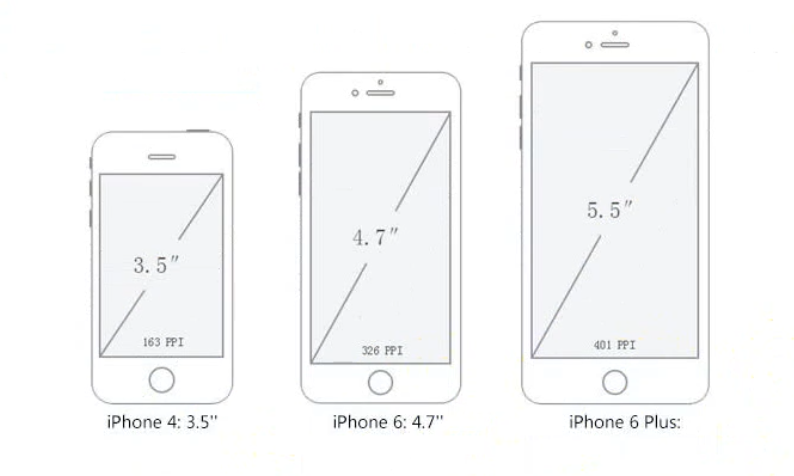

# 01-移动 Web 简介

## 一 知识术语

### 1.1 关于单位

长度单位可以分为：

- 绝对长度单位：in 英寸、cm 厘米
- 相对长度单位：px 像素、em、pt

px 是最常用的长度单位，此外还有 em、pt（点）、in（英寸）、cm（厘米）等可以作为开发中的长度单位。

### 1.2 分辨率与 Retina

移动设备与 PC 设备的最大差异在于屏幕的大小，包含两个关键因素：

- 屏幕尺寸：屏幕对角线的长度，一般使用英寸来度量
- 屏幕分辨率：屏幕水平和垂直方向的像素数，一般使用 px 来度量

手机屏幕大小如 4.7、5.0、6.0 这些其实是其对角线的长度，单位一般是英寸：



屏幕分辨率即屏幕纵向、横向上的像素点数，单位是 px，一般使用 `宽x高` 的方式表示，如：分辨率 `320x480` 表示水平方向 320 个像素，垂直方向 480 个像素。

英寸是一个绝对长度的单位，但是像素却是一个相对长度单位，如：iPhone3G/S 和 iPhone4/S 的屏幕尺寸都是 3.5 英寸(in)，但是其分辨率却分别为 `330x480`、`640x960`，所以像素其实是一个相对长度单位，

每英寸所拥有的像素数目越大，屏幕也越清晰，这称为 **PPI**。比如 iPhone4 的宽高像素分别是：`640x960`，那么根据勾股定理，可以得到其对角线的像素，而对角线的长度正好是 iPhone4 标明的 3.5 英寸，那么 iPhone4 的 PPI 就是：

$\sqrt{ 960^2 + 640^2 } \div 3.5 = 330$

苹果将拥有较高 PPI（大于 320）的屏幕称呼为视网膜屏幕（Retina）。

### 1.3 关于像素

**物理像素**：即物理分辨率，是设备屏幕实际拥有的像素点，比如 iPhone6 的像素是：`750x1334`，其实就是其在高度上有 1334 个像素点，在宽度上有 750 个像素点，其总共拥有的像素点是：`1334*750`。

**设备独立像素**：即逻辑分辨率，即当前设备能容纳的 CSS 像素。如手机 300-400 之间，10 寸平板在 700-800 之间，13 寸笔记本长边是 1280。比如：iPhone4/S 的像素是 `640x960`，但是在 Chrome 浏览器上模拟的大小却是`320x480`，这既是设备独立像素，Chrome 上的大小是当前的浏览器能装下的视口大小，与像素没有关系！

**像素比 dpr**：从上述示例看出，设备独立像素和物理像素往往是成比例的。当像素比为 1：1 时，1 个物理像素就用来显示 1 个设备独立像素，当像素比为 2：1 时，就需要使用 4 个物理像素显示 1 个设备独立像素（长 2 倍，宽 2 倍，即 2 倍屏）。像素比并不能决定屏幕的清晰度，PPI 才是核定屏幕清晰的最好评判方式（大于 320 即高清），不过**人眼能够识别的 dpr 最大是 2！**。

**CSS 像素**：CSS 像素即开发中使用的单位 px，CSS 像素最终转化为物理像素在屏幕中呈现，但是 CSS 中 1px 并不等于设备的 1px，因为在 Retina 屏中，分辨率提高了一倍，但是屏幕尺寸未发生变化，即同样大小的屏幕下，Retina 屏像素多了一倍，这时，1 个 CSS 像素即是 4 个物理像素。

**开发中，iphone678 设计稿的常见宽度为 750px，4.7~5 寸的安卓设备为 720px，一般均以 750px 为常见 CSS 像素宽度。**。

## 二 移动 web 解决方案

### 2.1 视口

PC 端的页面直接放置在手机端显示，由于页面过大无法显示全，就会出现滚动条，为了解决该问题，引入了**视口**。

> 视口：viewport，即浏览器 显示页面内容的**屏幕区域**，默认为 980px

比如现在的网页是 980px 宽度，而手机的视口默认是 980px，就可以将网页内的所有内容全部显示在手机上了，但是手机的屏幕真实大小毕竟远小于网页实际大小，那么就会造成页面中的文字等元素看起来变小了，需要手动放大才能显示完全。

视口分为 布局视口、视觉视口、理想视口：

**布局视口**（layout viewport）：在手机中，一般默认会有一个 980px 分辨率的视口，所以 PC 端网页都可以显示在手机中，但是此时 PC 端的页面在手机端看起来就会变小，往往需要手动缩放才能看清，显然并不是合适的视口选择。布局视口和硬件有关，是不会变化的，所以一般用来决定网页的真实布局。

**视觉视口**(visual viewport)：用户在手机端能看到的页面区域，视觉视口会变化，随着用户的缩放而变化。

**理想视口**(ideal viewport)：如果能够在视觉视口内显示一个完整的页面，又不会像布局视口那样大需要手指捏着屏幕看，这便是理想视口。

在代码上，理想视口所做的页面不再是默认 980px，而是与设备的视口宽度相同，需要手动进行设置：

```html
<meta name="viewport" content="width=device-width, initial-scale=1.0" />
```

content 常见属性：

```txt
width：视口宽度，如果不加则默认按照 980px 显示，页面元素就会变得很小，一般设置为device-width，即理想视口
user-scalable：是否允许用户缩放，默认为no
initial-scale：最初的缩放比例，比如值为2，则页面一打开，缩放为默认大小的2倍显示，一般为1
maximum-scale：最大允许缩放比例，一般为1.0
minimum-scale：最小允许缩放比例，一般为1.0
```

### 2.2 常见开发方案

网页如果要在移动端通过浏览器、APP 内嵌页显示，则需要考虑移动端的适配问题。目前有两种选型方案：

- **独立页面**：移动端页面与单独开发，与 PC 端页面脱离关系，是目前的主流方案，如 `m.jd.com`。
- **响应式页面**：PC 与移动端共用一个网页，根据屏幕宽度进行响应式适配，开发难度较大，适合一些小型订阅网站。

### 2.3 移动端布局方案

移动端浏览器内核一般为 webkit 内核，可以较大范围的使用 C3 技术，所以像弹性布局、媒体查询等技术都可以使用，常见的布局方式的实现有：

- 流式布局：即百分比布局，具有一定的局限性，往往与像素方式进行配合。
- rem 方式：根据字体随着设备大小的改变而改变，设定元素的大小。是当前主流方式之一。
- flex 布局：使用 flex 伸缩布局，是当前主流的方式之一。
- 栅格布局：适合制作响应式页面。

实际开发中，往往是多种实现方式互相配合的。

## 三 移动 web 常见问题

### 3.1 移动端的 CSS reset 文件

初始化移动端的 css，推荐使用第三方库:`normalize.css`，网址为：<https://github.com/necolas/normalize.css>。该库保留了一些有价值的默认值，修改了一部分浏览器 bug，且具备模块化开发方案！

### 3.2 倍图

在标准视口设置中，一般使用倍图来解决图片在视网膜屏中变模糊的问题，如`50px*50px`的 PC 端图片，需要一个 `100px*100px`图片，并将该图片手动缩小为`50px*50px`适配 iphone8，如下所示：

```css
/* 现在要展示的是50*50的图片，现在需要使用二倍图 100*100，然后手动将其修改为50*50 */
img {
  width: 50px;
  height: 50px;
}
```

贴士：PS 的插件 cutterman 可以快速进行二倍图、三倍图切图，方便实用！

贴士：2 倍精灵图不能在 PS 中直接测量，需要先将 2 倍精灵图等比例缩放为原来的一半（即精灵图的宽度改为原来的一半），代码中使用精灵图也需要设置 `background-size` 为原来宽度的一半。

### 3.3 背景缩放

图片可以缩放，背景在 C3 中也可以实现缩放，`background-size`属性可以设置背景图像的尺寸:

```css
/* 分别是背景图宽度 高度的缩放 */
background-size: 100px 200px;

/* 只写一个参数则是 宽度缩放,高度则会按照等比例缩放 */
background-size: 100px;

/* 相当于父盒子进行比例缩放 */
background-size: 20%;

/* cover: 将图像沿着两个方先无限拉伸盖住盒子,图片会出现被遮挡部分 */
background-size: cover;

/* contain: 将图像等比例拉伸,宽度或者高度有一个铺满盒子,图片会完整显示,但是可能不会完全覆盖为背景 */
background-size: contain;
```

### 3.4 特殊样式

```css
/* 点击后背景出现高亮，比如 a 标签。设置transparent完成透明， */
a {
  -webkit-tap-highligj-color: transparent;
}

/* iOS上如果要对按钮、输入框等自定义样式，需要额外设置属性 appearance */
button,
input {
  -webkit-appearance: none;
}

/* 禁用长按页面时的弹出菜单 */
img,
a {
  -webkit-touch-callout: none;
}
```

在移动端，body 一般要设计好自己样式，如下所示：

```css
body {
  margin: 0 auto;
  width: 100%; /*有了rem，可以设置为 15rem*/
  /* 在合理的范围内100%宽度 */
  min-width: 320px;
  max-width: 640px;
  font-family: -apple-system, 'Helvetica Neue', sans-serif;
  font-size: 14px;
  line-height: 1.5;
  background-color: #fff;
}
```
