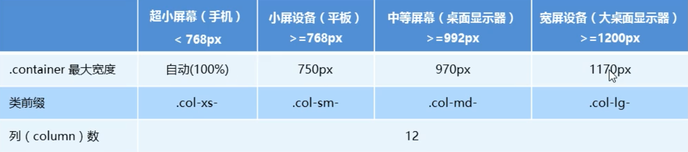

# 03-布局-5-栅格布局

## 一 栅格布局概念

网格布局（Grid Layout）将网页划分成一个个网格，通过组合不同的网格，制作出不同的布局效果。


网格布局与弹性布局较为相似，同样可以使用`align-items`,`justify-content`等属性。

## 二 使用栅格布局实现响应式

响应式布局并不能完全说是一种页面的真实布局方式，而是针对不同设备提出的布局思路，即：同一个网页在不同设备上自动调整其界面布局方式。

响应式开发原理：首先制作一个父级元素作为布局的容器，在不同屏幕下，通过媒体查询改变这个布局容器的大小，再改变其子元素的排列方式喝大小，从而实现对屏幕的适配。

常见的响应式尺寸划分：

- 超小屏幕：宽度设置为 100%，一般是手机，小于 768px
- 小型屏幕：宽度设置为 750px，一般是平板，大于等于 768px
- 中等屏幕：宽度设置为 970px，一般是桌面显示器，大于等于 992px
- 大型屏幕：宽度设置为 1200px，一般是大桌面显示器，大于等于 1200px

示例：

```html
<style>
  * {
    margin: 0;
    padding: 0;
  }

  li {
    list-style: none;
  }

  #container {
    height: 150px;
    margin: 0 auto;
    background-color: paleturquoise;
  }
  @media screen and (max-width: 767px) {
    #container {
      width: 100%;
    }
  }
  @media screen and (min-width: 768px) {
    #container {
      width: 750px;
    }
  }
  @media screen and (min-width: 992px) {
    #container {
      width: 970px;
    }
  }
  @media screen and (min-width: 1200px) {
    #container {
      width: 1170px;
    }
  }

  #container ul li {
    width: 93.75px;
    height: 30px;
    float: left;
    background-color: palevioletred;
  }
</style>

<div id="container">
  <ul>
    <li>菜单1</li>
    <li>菜单2</li>
    <li>菜单3</li>
    <li>菜单4</li>
    <li>菜单5</li>
    <li>菜单6</li>
    <li>菜单7</li>
    <li>菜单8</li>
  </ul>
</div>
```

## 三 原生栅格系统

## 四 Bootstrap 框架

### 4.1 Bootstrap 框架简介

Bootstrap 是 Twitter 公司基于 HTML、CSS、JavaScript 开发的响应式前端框架，且提供了大量的默认响应式组件。

三个相关网站：

- 官网：<https://getbootstrap.com/>
- 中文网：<https://www.bootcss.com/>
- 第三方资料：<https://bootstrap.css88.com>

Bootstrap 里的 containe 在不同屏幕下宽度不同，但值是固定的，随着屏幕或视口尺寸的增加，自动分配最多 12 列，若大于 12 列，多余的列将被作为一个整体另起一行排列。

贴士：Bootstrap 每一列默认有 15px 的 padding。

### 4.2 Bootstrap 的响应式

Bootstrap 使用 行（row）与列（column）组合来布局页面，如下所示：



贴士：

- row 必须放在 container 布局容器中
- 列必须平均换分，并添加类前缀
- xs-extra small:超小；sm-small:小；md-medium:中等；lg-large:大
- 可以同时为一列指定多个设备类名，以划分不同的份数，如：`class="colo-md-4 col-sm-6"`

示例：

```html
<div class="container">
  <!--col-lg-3 col-md-4 表示大屏幕下占3等份，中屏占4等份-->
  <!--如果子元素相加小于12，则无法占满一行-->
  <!--如果子元素相加为12，则正好可以占满一行-->
  <!--如果子元素相加大于12，超过部分的元素另起一行-->
  <div class="row">
    <div class="col-lg-3 col-md-4">1</div>
    <div class="col-lg-3 col-md-4">2</div>
    <div class="col-lg-3 col-md-4">3</div>
    <div class="col-lg-3 col-md-4">4</div>
  </div>
  <div class="row">
    <div class="col-lg-6">1</div>
    <div class="col-lg-2">2</div>
    <div class="col-lg-2">3</div>
    <div class="col-lg-1">4</div>
  </div>
</div>
```

对嵌套的支持：

```html
<div class="container">
  <div class="row">
    <div class="col-md-4">
      <div class="row">
        <div class="col-md-6">A</div>
        <div class="col-md-6">a</div>
      </div>
    </div>
    <div class="col-md-4">2</div>
    <div class="col-md-4">3</div>
  </div>
</div>
```

对列偏移支持：即为元素之间增加一定的偏移量：

```html
<div class="container">
  <div class="row">
    <div class="col-md-4"></div>
    <div class="col-md-4 col-md-offset-4"></div>
  </div>
</div>
```

### 4.3 Bootstrap 的响应式工具

针对不同屏幕可以快速设置隐藏、显示：


