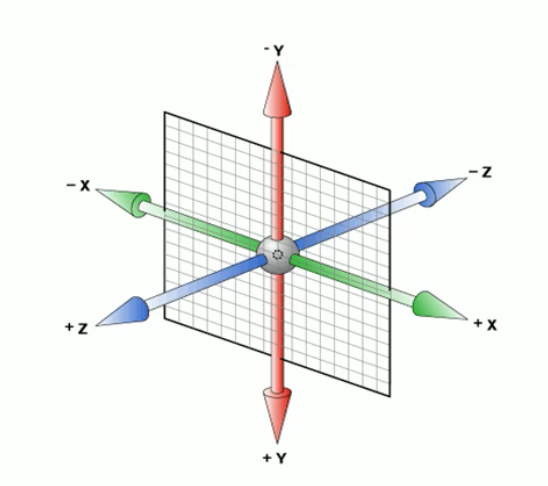

# 03-3D 转换

## 一 3D 转换概念

三维坐标系：

- X 轴：水平向右，X 轴原点的右边是正值，左边是负值
- Y 轴：垂直向下，Y 轴原点的下方是正值，上边是负值
- Z 轴：垂直屏幕，Z 轴原点向外面是正值，向里面是负值

如图所示：


## 二 3D 转换常用方式

### 2.0 透视

如果要从视觉上感觉到 Z 轴的变化，需要加上透视。

> 透视：人的眼睛到屏幕的距离，也称为视距。距离视觉点跃进街的在电脑平面中成像越大，距离越远成像越小，透视的单位也是像素。

在 CSS3 中，透视要写在被观察元素的父盒子上。

### 2.1 3D 位移 `translate3d`

示例：

```css
body {
  /* 透视 */
  perspective: 500px;
}

div {
  height: 200px;
  width: 200px;
  background-color: aqua;
  /* transform: translateX(100px) translateY(100px) translateZ(200px); */
  /* 简写 */
  transform: translate3d(400px, 100px, 200px);
}
```

注意：translateZ 一般使用单位为 px，不能像 translateX 和 translateY 那样使用百分比。

### 2.2 3D 旋转 `rotate3d`

2D 旋转只能使用角度旋转，3D 旋转则是可以围绕 X、Y、Z 轴进行旋转。

语法：

- `transform: rotateX(45deg)`
- `transform: rotateY(45deg)`
- `transform: rotateZ(45deg)`
- `transform: rotate3d(x,y,z,deg)`：沿着自定义轴旋转，deg 为角度

```css
div {
  height: 200px;
  width: 200px;
  background-color: aqua;
  /* transform: rotateX(45deg) rotateY(45deg) rotateZ(45deg); */
  /* 简写 */
  transform: translate3d(45deg, 45deg, 45deg);
}
```

## 三 3D 呈现 `transform-style`

`transform-style` 用来控制子元素是否开启三维环境，默认值为 `flat`，不开启，若要开启，设置其值为 `preserve-3d`。

注意：`transform-style`的设置要写给父盒子，但是影响的是其子盒子。
