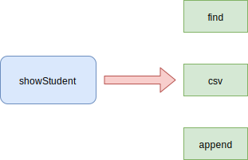
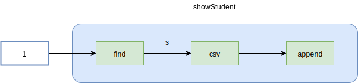

# 01.2-编程思想-函数式编程范式

## 一 函数式编程操作总结

函数式编程是指为了创建不可变程序，通过消除外部可见的富足用，来对纯函数的声明式的求值过程。

JavaScript 应用很容易出现严重依赖外部共享变量的地方，也容易写出存在很多分支、没有清晰结构的大函数，即使是一些由很多文件组成的模块化应用，也会形成一种共享的可变全局数据网，导致难以跟踪和调试。尝试思考 **纯** 的操作，将函数看做永不会修改数据的 **闭合功能单元**，可以在很大程度上减少潜在 BUG 的出现。

函数式编程的操作总结：

- 促使开发者将任务分解成简单的函数
- 使用流式的调用链来处理数据
- 通过响应式范式降低时间驱动代码的复杂性

## 二 函数式编程范式

### 2.1 分解、组合任务

从宏观上看，函数式编程实际上是分解和组合之间的相互作用：

- 将程序拆分为小片段
- 将小片段连接到一起

函数式编程这种二元性，才让程序变得模块化、高效，模块化单元也即是函数本身，这与单一职责原则息息相关。

下面是查询学生信息程序的分解：



run() 函数是用来组合各种函数的，最终实现整个程序，这涉及到了函数式编程的一个重要技术：**组合**。两个函数组合为一个新的函数，它拿到一个函数的输出，并将其传递到另外一个函数中：

```js
// f 组合上 g
f · g = f(g(x))
```

两个函数能组合的条件的是：它们必须在参数数目及参数类型上形成一致：

```js
const showStudent = run(append('box'), csv, find(db))

showStudent(1)
```



函数的组合可以提高抽象的层次，用来清晰地够了代码的所有步骤，但又不暴露任何底层细节。run() 函数接收函数为参数，被称为 **高阶函数**。

### 2.2 流式链处理数据

链其实是一连串函数的调用，类似 jQuery 的代码，共享一个通用的对象返回值（$/jQuery）。

与组合类似，链也有助于写出简明扼要的代码，常用于函数式、响应式 JavaScript 类库。

假设已知选课数据，计算选了多门课的学生的平均成绩，命令式的实现是：

```js
const data = [
  { enrolled: 1, result: 90 },
  { enrolled: 2, result: 78 },
  { enrolled: 1, result: 63 },
]

let totalResults = 0
let totalStudents = 0

for (let i = 0; i < data.length; i++) {
  let s = data[i]
  if (s !== null) {
    if (s.enrolled > 1) {
      totalResults += s.result
      totalStudents++
    }
  }
}

let average = totalResults / totalStudents
console.log(average) // 78
```

如果现在使用函数式编程思维解决问题，则有三个步骤：

- 选择选课数大于 1 的学生
- 获取他们的成绩
- 计算他们的呢平均成绩

函数链是一种惰性计算程序，这意味着当需要时才会执行。这对程序性能是有利的，因为可以避免执行可能包含一些永不会使用的内容的整个代码序列，节省宝贵的 CPU 计算周期，最终有模拟了其他函数式语言的按需调用的行为：

```js
// lodash
const data = [
  { enrolled: 1, result: 90 },
  { enrolled: 2, result: 78 },
  { enrolled: 1, result: 63 },
]

_.chain(
  data
    .filter((student) => student.enrolled > 1)
    .pluck('result')
    .average()
    .value()
)
```

与命令式程序比较，循环、条件语句被消除了，而且一些错误处理也被略过了。

### 2.3 复杂异步应用中的响应式范式

响应式范式可以提高代码的抽象级别，对优化类似 Ajax 这种异步场景、事件驱动程序代码有恩达的帮助。

下面是命令式代码，通过按键获取学生信息：

```js
let valid = false
let elem = document.querySelector('#stu')
elem.onkeyup = function () {
  let val = elem.value
  if (vla !== null && val.length !== 0) {
    val = val.replace(/^\s*|\s*$|\-s/g, '')
    if (val.length === 9) {
      console.log(`Valid id: ${val}!`)
      valid = true
    }
  } else {
    console.log('Invalid id: ${val}!')
  }
}
```

使用响应式编程范式里的 observable 订阅一个数据流，就可以通过组合、链式操作优雅的处理数据：

```js
Rx.Observable.fromEvent(document.querySelector('#stu'), 'keyup')
  .map((input) => input.srcElement.value)
  .filter((id) => id !== null && id.length !== 0)
  .map((id) => id.replace(/^\s*|\s*$|\-s/g, ''))
  .skipWhile((id) => id.length !== 9)
  .subscribe((validID) => console.log('Invalid id: ${validID}!'))
```

## 三 一些术语

### 3.1 高阶函数

在 JavaScript 中，函数是一等公民，也可以被看做数据类型，所以函数可以赋值给变量，作为参数传递，也可以被其他函数返回，简单来说：函数即是数据。

能够让基础函数获得额外能力的函数就是高阶函数（其实就是接收了一个函数为参数的函数），本质上是一个封装公共逻辑的过程，比如数组的一些方法：some、sort、map。

### 3.2 一元函数、二元函数

一元函数是只接受一个参数（unary）的函数，同理，二元函数是接收两个参数的函数，依次类推。

### 3.3 变参函数

接收可变数量参数的函数是变参函数，JavaScript 中 arguments 对象可以捕获到该函数的额外参数，ES6 后可以使用扩展运算符：

```js
const fn = (a, b, ...variadic) => {
  console.log(variadic)
}
fn(1, 2, 3, 4) // [3,4]
```
