# 02.1-函数式实现-lambda

## 一 理解程序控制流

命令式程序的控制流存在大量的循环和分支，如下所示：

```js
let loop = optC()
while (loop) {
  let condition = optA()
  if (condition) {
    optB1()
  } else {
    optB2()
  }
  loop = optC()
}
optD()
```



如果使用函数式开发风格操作数据结构，则会将数据与控制流视为一些高级组建的简单链接，代码类似：

```js
optA().optB().optC().optD()
```


## 二 函数链

### 2.1 lambda 表达式

lambda 表达式在 JavaScript 中可以用箭头函数表示，可以更加简洁的声明一个匿名函数：

```js
const name = (p) => p.fullname
console.log(name(p1))
```

不过要注意的是：lambda 表达式的应用对象是 lambda 表达式，得到的结果还是 lambda 表达式，相当于一个函数的参数是函数，返回值也是函数。

常用的 map、reduce、filter 等高阶函数与 lambda 表达式能够很好的配合使用。

### 2.2 map()数据变换

高阶函数 map 能够将一个迭代函数有序的应用于数组中每个元素，并返回一个长度相等的数组。

命令式获取名字数组：

```js
const data = [
  { id: 1, name: 'zs', age: 10 },
  { id: 2, name: 'ryj', age: 11 },
  { id: 3, name: 'ww', age: 13 },
  null,
  { id: 4, name: 'zs', age: 20 },
]

const result = []
for (let i = 0; i < data.length; i++) {
  if (data[i] !== null && data[i] !== undefined) {
    result.push(data[i].name)
  } else {
    result.push('')
  }
}
console.log(result)
```

map 方式获取：

```js
const data = [
  { id: 1, name: 'zs', age: 10 },
  { id: 2, name: 'ryj', age: 11 },
  { id: 3, name: 'ww', age: 13 },
  null,
  { id: 4, name: 'zs', age: 20 },
]

function map(arr, fn) {
  let index = -1
  let result = []

  while (++index < arr.length) {
    result.push(fn(arr[index]))
  }
  return result
}

const result = map(data, (s) => (s !== null && s !== undefined ? s.name : ''))
console.log(result)
```

### 2.3 reduce()收集结果

高阶函数 reduce 将一个数组中的元素精简为单一的值，该值是由每个元素与一个累积值通过一个函数计算得出的。

比如统计数据源中各个国家的人的数量：

```js
const data = [
  { id: 1, name: 'zs', address: { country: '中国' } },
  { id: 2, name: 'ryj', address: { country: '中国' } },
  { id: 3, name: 'ww', address: { country: '美国' } },
  { id: 4, name: 'zs', address: {} },
]

function reduce(arr, fn, accumulator) {
  let index = -1

  if (!accumulator && arr.length > 0) {
    accumulator = arr[++index]
  }

  while (++index < arr.length) {
    accumulator = fn(accumulator, arr[index], index, arr)
  }
  return accumulator
}

const fn = (stat, p) => {
  const country = p.address.country
  stat[country] = stat[country] === undefined ? 1 : stat[country] + 1
  return stat
}
let res = reduce(data, fn, {})
console.log(res)
```

也可以使用 map 进行预处理，先提取国家信息：

```js
const getCountry = (p) => p.address.country

const gatherStats = (stat, criteria) => {
  stat[criteria] = stat[criteria] === undefined ? 1 : stat[criteria] + 1
  return stat
}

let res = reduce(map(data, getCountry), gatherStats, {})
```

此外，还可以进一步修改为链式调用。

### 2.4 filter()过滤

上述数据可以使用 filter 进行清理，删除掉没有写入国家数据的元素：

```js
const data = [
  { id: 1, name: 'zs', address: { country: '中国' } },
  { id: 2, name: 'ryj', address: { country: '中国' } },
  { id: 3, name: 'ww', address: { country: '美国' } },
  { id: 4, name: 'zs', address: {} },
]

function filter(arr, predicate) {
  let index = -1
  let result = []

  while (++index < arr.length) {
    if (predicate(arr[index])) {
      result.push(arr[index])
    }
  }
  return result
}

const res = filter(data, (item) =>
  item.address.country === undefined ? false : true
)
console.log(res)
```

## 2.5 数组推导式

map 和 filter 都是能够根据当前数组生成新数组的高阶函数。组合 map 和 filter 的另 一种方法是使用数组推导式一一－也被称为列表推导式。这是一种使用关键字 `for · · · of` 和 `if` 的简明语法，并能够将 map 和 filter 的功能封装在一起：

```js
[for (x of iterable ) if ( condition) x]
```
