# 14.1-组合模式

## 一 组合模式概念

组合模式将对象组合成树形结构，以表示“部分  整体”的层次结构。 除了用来表示树形结构之外，组合模式的另一个好处是通过对象的多态性表现，使得用户对单个对象和组合对象的使用具有一致性：

- 表示树形结构。通过回顾上面的例子，我们很容易找到组合模式的一个优点：提供了一种遍历树形结构的方案，通过调用组合对象的 execute 方法，程序会递归调用组合对象下面的叶对象的 execute 方法，所以我们的万能遥控器只需要一次操作，便能依次完成关门、打开电脑、登录 QQ 这几件事情。组合模式可以非常方便地描述对象部分/整体层次结构
- 利用对象多态性统一对待组合对象和单个对象。利用对象的多态性表现，可以使客户端忽略组合对象和单个对象的不同。在组合模式中，客户将统一地使用组合结构中的所有对象，而不需要关心它究竟是组合对象还是单个对象

请求从树最顶端的对象往下传递，如果当前处理请求的对象是叶对象（普通子命令），叶对象自身会对请求作出相应的处理；如果当前处理请求的对象是组合对象（宏命令），
组合对象则会遍历它属下的子节点，将请求继续传递给这些子节点。如果子节点是叶对象，叶对象自身会处理这个请求，而如果子节点还是组合对象，请求会继续往下传递。叶对象下面不会再有其他子节点，一个叶对象就是树的这条枝叶的尽头，组合对象下面可能还会有子节点：



请求从上到下沿着树进行传递，直到树的尽头。作为客户，只需要关心树最顶层的组合对象，客户只需要请求这个组合对象，请求便会沿着树往下传递，依次到达所有的叶对象。

## 二 组合模式实现

### 2.1 宏命令示例

```js
// 宏命令
class MacroCommand {
  commandsList = []
  add(command) {
    this.commandsList.push(command)
  }
  execute() {
    for (let i = 0, command; (command = this.commandsList[i++]); ) {
      command.execute()
    }
  }
}

// 打开空调命令
class OpenAcCommand {
  execute() {
    console.log('打开空调')
  }
}

// 关门命令
class CloseDoorCommand {
  execute() {
    console.log('关门')
  }
}

// 打开电视、音箱。电视和音响是连接在一起的，所以可以用一个宏命令来组合
class OpenTvCommand {
  execute() {
    console.log('打开电视')
  }
}
class OpenSoundCommand {
  execute() {
    console.log('打开音响')
  }
}
const macroCommand1 = new MacroCommand()
macroCommand1.add(new OpenTvCommand())
macroCommand1.add(new OpenSoundCommand())

// 组合所有命令为一盒超级宏命令
const mainCommand = new MacroCommand()
mainCommand.add(new OpenAcCommand())
mainCommand.add(new CloseDoorCommand())
mainCommand.add(macroCommand1)

// 给按钮绑定超级命令
const setCommand = (command) => {
  document.querySelector('button').addEventListener('click', () => {
    command.execute()
  })
}
setCommand(mainCommand) // 按下遥控器所有命令都会执行
```

叶节点下面没有子节点， 所以有发生误操作的可能，比如试图往叶对象中添加子节点。解决方案通常是给叶对象也增加 add 方法，并且在调用这个方法时，抛出一个异常来及时提醒客户：

```js
class OpenSoundCommand {
  execute() {
    console.log('打开音响')
  }
  add() {
    throw new Error('叶对象不能添加子节点')
  }
}
```

## 三 组合模式应用

### 3.1 扫描文件夹

文件夹和文件之间的树状关系，非常适合用组合模式来描述。组合模式在文件夹的应用中有以下两层好处：

- 复制一个盘里的文件到另外一个盘，不用考虑文件类型，无论是文件还是文件夹，复制、粘贴 2 个操作都是统一的操作
- 杀毒软件扫描时，组合模式让软件只需要关心最外层文件夹，无需关心内部有多少文件、子文件夹

```js
class Folder {
  files = []
  constructor(name) {
    this.name = name
  }
  add(file) {
    this.files.push(file)
  }
  scan() {
    console.log('开始扫描文件夹: ' + this.name)
    for (let i = 0, file, files = this.files; (file = files[i++]); ) {
      file.scan()
    }
  }
}

class File {
  constructor(name) {
    this.name = name
  }
  add() {
    throw new Error('文件下面不能再添加文件')
  }
  scan() {
    console.log('开始扫描文件: ' + this.name)
  }
}

// 创建一些文件夹、文件，组成一棵树
const folder = new Folder('学习资料')
const folder1 = new Folder('JavaScript')
const folder2 = new Folder('jQuery')
const file1 = new File('JavaScript 设计模式与开发实践')
const file2 = new File('精通 jQuery')
const file3 = new File('重构与模式')
folder1.add(file1)
folder2.add(file2)
folder.add(folder1)
folder.add(folder2)
folder.add(file3)

// 复制一个盘到另外一个盘
const folder3 = new Folder('Nodejs')
const file4 = new File('深入浅出 Node.js')
folder3.add(file4)
const file5 = new File('JavaScript 语言精髓与编程实践')

// 把这些文件都添加到原有的树中：
folder.add(folder3)
folder.add(file5)

folder.scan()
```

### 3.2 删除文件引用付对象

组合对象保存了它下面的子节点的引用，这是组合模式的特点，此时树结构是从上至下的。

有时候我们需要在子节点上保持对父节点的引用，比如在组合模式中使用职责链时，有可能需要让请求从子节点往父节点上冒泡传递。还有当我们删除某个文件的时候，实际上是从这个文件所在的上层文件夹中删除该文件的。

本示例需要使得在扫描整个文件夹之前，先移除某一个具体的文件。首先改写 Folder 类和 File 类，在这两个类的构造函数中，增加 this.parent 属性，并且在调
用 add 方法的时候，正确设置文件或者文件夹的父节点：

```js
class Folder {
  files = []
  parent = null //设置父对象
  constructor(name) {
    this.name = name
  }
  add(file) {
    this.parent = this //设置父对象
    this.files.push(file)
  }
  scan() {
    console.log('开始扫描文件夹: ' + this.name)
    for (let i = 0, file, files = this.files; (file = files[i++]); ) {
      file.scan()
    }
  }
  // 移除文件夹
  remove() {
    // 文件夹要么是树的根节点，要么是还没有添加到树的游离节点，这时候没有节点需要从树中移除，
    if (!this.parent) {
      return
    }
    // 存在父节点：遍历父节点中保存的子节点列表，删除想要删除的子节点
    for (let files = this.parent.files, l = files.length - 1; l >= 0; l--) {
      let file = files[l]
      if (file === this) {
        files.splice(l, 1)
      }
    }
  }
}

class File {
  constructor(name) {
    this.name = name
    parent = null //设置父对象
  }
  add() {
    throw new Error('文件下面不能再添加文件')
  }
  scan() {
    console.log('开始扫描文件: ' + this.name)
  }
  remove() {
    // 文件夹要么是树的根节点，要么是还没有添加到树的游离节点，这时候没有节点需要从树中移除，
    if (!this.parent) {
      return
    }
    // 存在父节点：遍历父节点中保存的子节点列表，删除想要删除的子节点
    for (let files = this.parent.files, l = files.length - 1; l >= 0; l--) {
      let file = files[l]
      if (file === this) {
        files.splice(l, 1)
      }
    }
  }
}

const folder = new Folder('学习资料')
const folder1 = new Folder('JavaScript')
const file1 = new Folder('深入浅出 Node.js')
folder1.add(new File('JavaScript 设计模式与开发实践'))
folder.add(folder1)
folder.add(file1)
folder1.remove() //移除文件夹
folder.scan()
```

## 四 总结

### 4.1 组合模式不是父子关系

组合模式是一种 HAS-A（聚合）的关系，而不是 IS-A。组合对象包含一组叶对象，但 Leaf 并不是 Composite 的子类。组合对象把请求委托给它所包含的所有叶对象，它们能够合作的关键是拥有相同的接口。

为了方便描述，本章有时候把上下级对象称为父子节点，但大家要知道，它们并非真正意义上的父子关系。

### 4.2 对叶对象操作的一致性

组合模式除了要求组合对象和叶对象拥有相同的接口之外，还有一个必要条件，就是对一组叶对象的操作必须具有一致性。

比如公司要给全体员工发放元旦的过节费 1000 块，这个场景可以运用组合模式，但如果公司给今天过生日的员工发送一封生日祝福的邮件，组合模式在这里就没有用武之地了，除非先把今天过生日的员工挑选出来。只有用一致的方式对待列表中的每个叶对象的时候，才适合使用组合模式。

### 4.3 双向映射关系

发放过节费的通知步骤是从公司到各个部门，再到各个小组，最后到每个员工的邮箱里。这本身是一个组合模式的好例子，但要考虑的一种情况是，也许某些员工属于多个组织架构。比如某位架构师既隶属于开发组，又隶属于架构组，对象之间的关系并不是严格意义上的层次结构，在这种情况下，是不适合使用组合模式的，该架构师很可能会收到两份过节费。

这种复合情况下我们必须给父节点和子节点建立双向映射关系，一个简单的方法是给小组和员工对象都增加集合来保存对方的引用。但是这种相互间的引用相当复杂，而且对象之间产生了过多的耦合性，修改或者删除一个对象都变得困难，此时我们可以引入中介者模式来管理这些对象。

### 4.4 用职责链模式提高组合模式性能

在组合模式中，如果树的结构比较复杂，节点数量很多，在遍历树的过程中，性能方面也许表现得不够理想。有时候我们确实可以借助一些技巧，在实际操作中避免遍历整棵树，有一种现成的方案是借助职责链模式。职责链模式一般需要我们手动去设置链条，但在组合模式中，父对象和子对象之间实际上形成了天然的职责链。让请求顺着链条从父对象往子对象传递，或者是反过来从子对象往父对象传递，直到遇到可以处理该请求的对象为止，这也是职责链模式的经典运用场景之一。

### 4.5 何时使用组合模式

组合模式如果运用得当，可以大大简化客户的代码。一般来说，组合模式适用于以下这两种情况：

- 表示对象的部分-整体层次结构。组合模式可以方便地构造一棵树来表示对象的部分-整体结构。特别是我们在开发期间不确定这棵树到底存在多少层次的时候。在树的构造最终完成之后，只需要通过请求树的最顶层对象，便能对整棵树做统一的操作。在组合模式中增加和删除树的节点非常方便，并且符合开放  封闭原则。
- 客户希望统一对待树中的所有对象。组合模式使客户可以忽略组合对象和叶对象的区别，客户在面对这棵树的时候，不用关心当前正在处理的对象是组合对象还是叶对象，也就不用写一堆 if、else 语句来分别处理它们。组合对象和叶对象会各自做自己正确的事情，这是组合模式最重要的能力。
