# 14.1-中介者模式

## 一 中介者模式概念

平时我们大概能记住 10 个朋友的电话、30 家餐馆的位置。在程序里，也许一个对象会和其他 10 个对象打交道，所以它会保持 10 个对象的引用。当程序的规模增大，对象会越来越多，它们之间的关系也越来越复杂，难免会形成网状的交叉引用。当我们改变或删除其中一个对象的时候，很可能需要通知所有引用到它的对象。



面向对象设计鼓励将行为分布到各个对象中，把对象划分成更小的粒度，有助于增强对象的可复用性，但由于这些细粒度对象之间的联系激增，又有可能会反过来降低它们的可复用性。

中介者模式的作用就是解除对象与对象之间的紧耦合关系。增加一个中介者对象后，所有的相关对象都通过中介者对象来通信，而不是互相引用，所以当一个对象发生改变时，只需要通知中介者对象即可。中介者使各对象之间耦合松散，而且可以独立地改变它们之间的交互。中介者模式使网状的多对多关系变成了相对简单的一对多关系。


使用中介者模式改进之后，A 发生改变时则只需要通知这个中介者对象即可。

现实中的中介者模式有：机场指挥塔等。

## 二 中介者模式实现

## 三 中介者模式应用

### 3.1 对战游戏示例

对战游戏中的玩家，有三种方法：win、lose、die：

```js
class Player {
  enemyList = null // 敌人
  constructor(name) {
    this.name = name
  }
  win() {
    console.log(this.name + ' won ')
  }
  lose() {
    console.log(this.name + ' lost')
  }
  die() {
    this.lose()
    this.enemy.win()
  }
}

// 创建2个玩家
const player1 = new Player('皮蛋')
const player2 = new Player('小乖')
player1.enemy = player2
player2.enemy = player1

// 如果玩家1被击败直接调用die方法即可
player1.die() // 输出：皮蛋 lost、小乖 won
```

上述游戏只满足 2 个用户，在多人对战中，可以定义一个数组 players 来保存所有的玩家在创建玩家之后，循环 players 来给每个玩家设置队友和敌人：

```js
const players = []

class Player {
  partners = [] // 队友列表
  enemies = [] // 敌人列表
  state = 'live' // 存活状态

  constructor(name, teamColor) {
    this.name = name
    this.teamColor = teamColor
  }

  win() {
    console.log('winner: ' + this.name)
  }
  lose() {
    console.log('loser: ' + this.name)
  }
  die() {
    let all_dead = true
    this.state = 'dead' // 设置玩家状态为死亡
    for (let i = 0, partner; (partner = this.partners[i++]); ) {
      // 遍历队友列表
      if (partner.state !== 'dead') {
        // 如果还有一个队友没有死亡，则游戏还未失败
        all_dead = false
        break
      }
    }
    if (all_dead === true) {
      // 如果队友全部死亡
      this.lose() // 通知自己游戏失败
      for (let i = 0, partner; (partner = this.partners[i++]); ) {
        // 通知所有队友玩家游戏失败
        partner.lose()
      }
      for (let i = 0, enemy; (enemy = this.enemies[i++]); ) {
        // 通知所有敌人游戏胜利
        enemy.win()
      }
    }
  }
}

// 创建玩家工厂
const playerFactory = function (name, teamColor) {
  const newPlayer = new Player(name, teamColor) // 创建新玩家
  for (let i = 0, player; (player = players[i++]); ) {
    // 通知所有的玩家，有新角色加入
    if (player.teamColor === newPlayer.teamColor) {
      // 如果是同一队的玩家
      player.partners.push(newPlayer) // 相互添加到队友列表
      newPlayer.partners.push(player)
    } else {
      player.enemies.push(newPlayer) // 相互添加到敌人列表
      newPlayer.enemies.push(player)
    }
  }
  players.push(newPlayer)
  return newPlayer
}

// 创建 8 个玩家：
//红队：
const player1 = playerFactory('皮蛋', 'red'),
  player2 = playerFactory('小乖', 'red'),
  player3 = playerFactory('宝宝', 'red'),
  player4 = playerFactory('小强', 'red')
//蓝队：
const player5 = playerFactory('黑妞', 'blue'),
  player6 = playerFactory('葱头', 'blue'),
  player7 = playerFactory('胖墩', 'blue'),
  player8 = playerFactory('海盗', 'blue')

// 让红队玩家全部死亡：
player1.die()
player2.die()
player4.die()
player3.die()
```

上述示例中，每个玩家和其他玩家都是紧紧耦合在一起的。在此段代码中，每个玩家对象都有两个属性，this.partners 和 this.enemies，用来保存其他玩家对象的引用。当每个对象的状态发生改变，比如角色移动、吃到道具或者死亡时，都必须要显式地遍历通知其他对象。

当玩家用户更多后，会带来更大的开发困扰，引入中介者：

```js
class Player {
  state = 'alive'
  constructor(name, teamColor) {
    this.name = name
    this.teamColor = teamColor
  }

  win() {
    console.log('winner: ' + this.name)
  }
  lose() {
    console.log('loser: ' + this.name)
  }
  die() {
    this.state = 'dead'
    playerDirector.reciveMessage('playerDead', this) // 给中介者发送消息，玩家死亡
  }
  // 移除玩家
  remove() {
    playerDirector.reciveMessage('removePlayer', this) // 给中介者发送消息，移除一个玩家
  }
  // 玩家换队
  changeTeam(color) {
    playerDirector.reciveMessage('changeTeam', this, color) // 给中介者发送消息，玩家换队
  }
}

// 创建玩家工厂
const playerFactory = function (name, teamColor) {
  const newPlayer = new Player(name, teamColor) // 创造一个新的玩家对象
  playerDirector.reciveMessage('addPlayer', newPlayer) // 给中介者发送消息，新增玩家
  return newPlayer
}
```

实现中介者对象有两种方式：

- 利用发布—订阅模式。将 playerDirector 实现为订阅者，各 player 作为发布者，一旦 player 的状态发生改变，便推送消息给 playerDirector，playerDirector 处理消息后将反馈发送给其他 player。
- 在 playerDirector 中开放一些接收消息的接口，各 player 可以直接调用该接口来给 playerDirector 发送消息，player 只需传递一个参数给 playerDirector，这个参数的目的是使 playerDirector 可以识别发送者。同样，playerDirector 接收到消息之后会将处理结果反馈给其他 player。

二者没有本质区别，这里采用第二种，playerDirector 开放一个对外暴露的接口 reciveMessage，负责接收 player 对象发送的消息，而 player 对象发送消息
的时候，总是把自身 this 作为参数发送给 playerDirector，以便 playerDirector 识别消息来自于哪个玩家对象：

```js
// 中介者
const playerDirector = (function () {
  const players = {}, // 保存所有玩家
    operations = {} // 中介者可以执行的操作

  /****************新增一个玩家***************************/
  operations.addPlayer = function (player) {
    const teamColor = player.teamColor // 玩家的队伍颜色
    players[teamColor] = players[teamColor] || [] // 如果该颜色的玩家还没有成立队伍，则新成立一个队伍
    players[teamColor].push(player) // 添加玩家进队伍
  }
  /****************移除一个玩家***************************/
  operations.removePlayer = function (player) {
    const teamColor = player.teamColor, // 玩家的队伍颜色
      teamPlayers = players[teamColor] || [] // 该队伍所有成员
    for (let i = teamPlayers.length - 1; i >= 0; i--) {
      // 遍历删除
      if (teamPlayers[i] === player) {
        teamPlayers.splice(i, 1)
      }
    }
  }
  /****************玩家换队***************************/
  operations.changeTeam = function (player, newTeamColor) {
    // 玩家换队
    operations.removePlayer(player) // 从原队伍中删除
    player.teamColor = newTeamColor // 改变队伍颜色
    operations.addPlayer(player) // 增加到新队伍中
  }
  operations.playerDead = function (player) {
    // 玩家死亡
    var teamColor = player.teamColor,
      teamPlayers = players[teamColor] // 玩家所在队伍
    var all_dead = true
    for (var i = 0, player; (player = teamPlayers[i++]); ) {
      if (player.state !== 'dead') {
        all_dead = false
        break
      }
    }

    if (all_dead === true) {
      // 全部死亡
      for (var i = 0, player; (player = teamPlayers[i++]); ) {
        player.lose() // 本队所有玩家 lose
      }
      for (var color in players) {
        if (color !== teamColor) {
          var teamPlayers = players[color] // 其他队伍的玩家
          for (var i = 0, player; (player = teamPlayers[i++]); ) {
            player.win() // 其他队伍所有玩家 win
          }
        }
      }
    }
  }
  const reciveMessage = function () {
    const message = Array.prototype.shift.call(arguments) // arguments 的第一个参数为消息名称
    operations[message].apply(this, arguments)
  }
  return {
    reciveMessage: reciveMessage,
  }
})()

// 让红队玩家全部死亡：
// player1.die()
// player2.die()
// player4.die()
// player3.die()

// 假设皮蛋和小乖掉线，则结果如图 14-6 所示。
// player1.remove();
// player2.remove();
// player3.die();
// player4.die();

// 假设皮蛋从红队叛变到蓝队
player1.changeTeam('blue')
player2.die()
player3.die()
player4.die()
```

可以看到，除了中介者本身，没有一个玩家知道其他任何玩家的存在，玩家与玩家之间的耦合关系已经完全解除，某个玩家的任何操作都不需要通知其他玩家，而只需要给中介者发送一个消息，中介者处理完消息之后会把处理结果反馈给其他的玩家对象。我们还可以继续给中介者扩展更多功能，以适应游戏需求的不断变化。

## 四 总结

中介者模式是迎合迪米特法则的一种实现。迪米特法则也叫最少知识原则，是指一个对象应该尽可能少地了解另外的对象（类似不和陌生人说话）。如果对象之间的耦合性太高，一个对象发生改变之后，难免会影响到其他的对象，跟“城门失火，殃及池鱼”的道理是一样的。而在中介者模式里，对象之间几乎不知道彼此的存在，它们只能通过中介者对象来互相影响对方。

因此，中介者模式使各个对象之间得以解耦，以中介者和对象之间的一对多关系取代了对象之间的网状多对多关系。各个对象只需关注自身功能的实现，对象之间的交互关系交给了中介者对象来实现和维护。

不过，中介者模式也存在一些缺点。其中，最大的缺点是系统中会新增一个中介者对象，因为对象之间交互的复杂性，转移成了中介者对象的复杂性，使得中介者对象经常是巨大的。中介者对象自身往往就是一个难以维护的对象。
